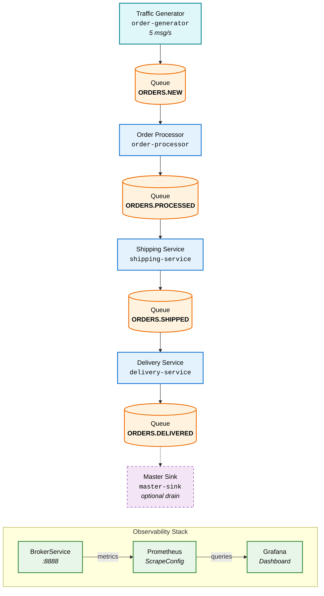
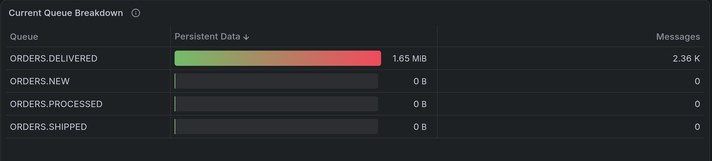
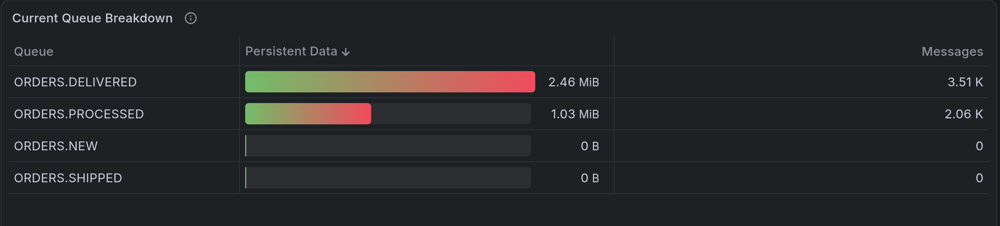
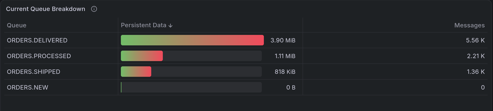
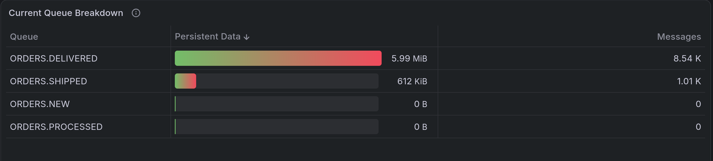

## 1. What We're Building

This tutorial builds a realistic event-driven order-processing pipeline on Kubernetes and shows how to observe it with Prometheus and Grafana.

The pipeline processes orders through four stages — generation, processing, shipping, and delivery — each running as a separate Camel JMS application connected to a shared Apache Artemis broker. Every stage communicates exclusively through the broker using mTLS, with access enforced by `BrokerApp` RBAC so each application can only read from and write to the queues it owns.

The broker is deployed as a `BrokerService`, which the ArkMQ Operator manages automatically: it provisions the StatefulSet, configures per-application acceptors, exposes Prometheus metrics on port 8888, and generates the `ScrapeConfig` that tells Prometheus where to scrape. A Grafana dashboard visualizes memory usage and queue depth in real time.

The three scenario sections at the end let you interactively create a processing bottleneck, diagnose the resulting backlog in Grafana, and recover by scaling the bottleneck deployment.

### Architecture



**One reusable Camel image, four application roles.**
The same container image (`camel-jms-app`) is deployed four times for the core pipeline. An optional fifth deployment, `master-sink`, can drain the terminal queue when needed.
Role and queue configuration come from environment variables.

| Kubernetes Deployment | BrokerApp identity | `APP_ROLE` | Consumes | Produces |
|---|---|---|---|---|
| order-generator | `order-generator` | `generator` | — | `ORDERS.NEW` |
| order-processor-app | `order-processor` | `processor` | `ORDERS.NEW` | `ORDERS.PROCESSED` |
| shipping-service-app | `shipping-service` | `shipping` | `ORDERS.PROCESSED` | `ORDERS.SHIPPED` |
| delivery-service-app | `delivery-service` | `delivery` | `ORDERS.SHIPPED` | `ORDERS.DELIVERED` |
| camel-jms-master-sink *(optional)* | `master-sink` | `sink` | `ORDERS.DELIVERED` | — |

The Kubernetes Deployment name is the full service name (e.g. `order-processor-app`). The BrokerApp identity drops the `-app` suffix (e.g. `order-processor`) so that the operator-derived certificate secret name (`{brokerAppName}-app-cert`) matches the certificate created for the deployment.

### Prerequisites

- A running Kubernetes cluster (this tutorial uses `minikube`)
- `kubectl` configured to interact with your cluster
- `helm` installed for deploying monitoring components
- A container build tool (`docker` or `podman`) available locally

> **Naming note:** Throughout this tutorial the optional terminal consumer is called `master-sink` as a conceptual role. The corresponding Kubernetes resources use more specific names: the BrokerApp is `master-sink-app`, and the Camel Deployment is `camel-jms-master-sink`.

---

## 2. Setup Infrastructure

### Start Minikube

```bash {"stage":"init", "id":"minikube_start", "runtime":"bash"}
minikube start \
  --profile brokerservice-monitoring \
  --cpus 2 \
  --memory 8192 \
  --disk-size 20000
minikube addons enable ingress --profile brokerservice-monitoring
```
```shell markdown_runner
* [brokerservice-monitoring] minikube v1.37.0 on Fedora 44
  - MINIKUBE_ROOTLESS=true
* Automatically selected the kvm2 driver. Other choices: podman, qemu2, ssh
* Starting "brokerservice-monitoring" primary control-plane node in "brokerservice-monitoring" cluster
* Configuring bridge CNI (Container Networking Interface) ...
* Verifying Kubernetes components...
  - Using image gcr.io/k8s-minikube/storage-provisioner:v5
* Enabled addons: storage-provisioner, default-storageclass
* Done! kubectl is now configured to use "brokerservice-monitoring" cluster and "default" namespace by default
* ingress is an addon maintained by Kubernetes. For any concerns contact minikube on GitHub.
You can view the list of minikube maintainers at: https://github.com/kubernetes/minikube/blob/master/OWNERS
  - Using image registry.k8s.io/ingress-nginx/controller:v1.13.2
  - Using image registry.k8s.io/ingress-nginx/kube-webhook-certgen:v1.6.2
  - Using image registry.k8s.io/ingress-nginx/kube-webhook-certgen:v1.6.2
* Verifying ingress addon...
* The 'ingress' addon is enabled
```

### Build the Camel Pipeline Image

The Camel pipeline image is built by your local container tool (which has
internet access for Maven dependencies) and then loaded into Minikube. Either
`docker` or `podman` works; the image is handed to Minikube as a tar archive so
the step does not depend on which one you have.
The source lives alongside this tutorial in [`camel-jms-app/`](camel-jms-app/).
The `Containerfile` is a multi-stage build — Maven and the JDK run inside the
builder container, so no local JDK or Maven installation is required.

```bash {"stage":"init", "label":"build camel jms image", "rootdir":"$initial_dir", "runtime":"bash"}
CONTAINER_TOOL=$(command -v docker || command -v podman)
if [ -z "${CONTAINER_TOOL}" ]; then
  echo "Neither docker nor podman was found on PATH" >&2
  exit 1
fi

"${CONTAINER_TOOL}" build \
  -f docs/tutorials/brokerservice/camel-jms-app/Containerfile \
  docs/tutorials/brokerservice/camel-jms-app/ \
  -t camel-jms-app:latest

# minikube image load reads a name from the docker daemon, which podman does not
# populate, so go through a tar archive instead
CAMEL_IMAGE_TAR=$(mktemp -t camel-jms-app-XXXXXX.tar)
"${CONTAINER_TOOL}" save camel-jms-app:latest -o "${CAMEL_IMAGE_TAR}"
minikube image load "${CAMEL_IMAGE_TAR}" --profile brokerservice-monitoring
rm -f "${CAMEL_IMAGE_TAR}"

# podman normalises an unqualified build tag to localhost/<name> while docker
# keeps it bare. The deployments reference the bare name, so add it when the
# prefixed one is what landed.
if minikube image ls --profile brokerservice-monitoring | grep -qx 'localhost/camel-jms-app:latest'; then
  minikube image tag localhost/camel-jms-app:latest camel-jms-app:latest \
    --profile brokerservice-monitoring
fi
```
```shell markdown_runner
[1/2] STEP 1/8: FROM registry.access.redhat.com/ubi9/openjdk-21 AS builder
[1/2] STEP 2/8: USER root
--> Using cache 4399974dabb7aec115bbd45d18508842e655ccea517e83b9d7315a22e0e6fab9
--> 4399974dabb7
[1/2] STEP 3/8: WORKDIR /build
--> Using cache 8f0b7b3242a8404879eb308a912f7eb270ae03fe267bdfa7bade5420d927e33f
--> 8f0b7b3242a8
[1/2] STEP 4/8: RUN microdnf install -y maven --setopt=install_weak_deps=0 && microdnf clean all
--> Using cache 02458b1f79e4ce417b84a1e4af8b70914c42b224b3ef7f11794cd355e01b8c9b
--> 02458b1f79e4
[1/2] STEP 5/8: COPY pom.xml pom.xml
--> Using cache 419e371cd36539eea6480d347c360b932ffa34bf1abd9c5935034ba698cadae9
--> 419e371cd365
[1/2] STEP 6/8: RUN mvn dependency:resolve-plugins dependency:resolve -q
--> Using cache 061030dacfc62d91193c833c03aa6368e0e9d520c6e02275875e2535ad3f6231
--> 061030dacfc6
[1/2] STEP 7/8: COPY src/ src/
--> Using cache bc74ed0d6ee4d647e13a3b6ea6fba8a0b5480fbc78bb428013d05375f501c774
--> bc74ed0d6ee4
[1/2] STEP 8/8: RUN mvn package -DskipTests -q
--> Using cache 89361dccf15a806a97d5ac9948bca11b437dcba7e164ca3ef6ee43cc700c7b51
--> 89361dccf15a
[2/2] STEP 1/11: FROM registry.access.redhat.com/ubi9/openjdk-21-runtime
[2/2] STEP 2/11: ENV LANGUAGE='en_US:en'
--> Using cache 169cbbb706629c10ea513e176257847f81cb3d9d716a609ee93fc77e28b9c826
--> 169cbbb70662
[2/2] STEP 3/11: COPY --chown=185 --from=builder /build/target/quarkus-app/lib/       /deployments/lib/
--> Using cache ad406611c4fe0fd0f211a1e79c9cc2c6f082bfd2d269477706065888c956e50c
--> ad406611c4fe
[2/2] STEP 4/11: COPY --chown=185 --from=builder /build/target/quarkus-app/*.jar       /deployments/
--> Using cache 5042e45f997f75d921512c1bdd1e3f8d954ec1f6271e2b12d1540c4f11abe764
--> 5042e45f997f
[2/2] STEP 5/11: COPY --chown=185 --from=builder /build/target/quarkus-app/app/        /deployments/app/
--> Using cache b4b94458d81a6594497b2c67ea296a19ea12c899314fddae3e701e2d2e42f905
--> b4b94458d81a
[2/2] STEP 6/11: COPY --chown=185 --from=builder /build/target/quarkus-app/quarkus/    /deployments/quarkus/
--> Using cache c65ab3a8f0616a73dc8709c4ccc2ec7f1cf92f7c3f3f45ac25b1f293db18f536
--> c65ab3a8f061
[2/2] STEP 7/11: EXPOSE 8080
--> Using cache 91c98d9dd00cb77536d4ca67933bc1af4699e8b866996c23d8998c5e7b166f3e
--> 91c98d9dd00c
[2/2] STEP 8/11: USER 185
--> Using cache 88422a29f12d0eaa093c20211af128e18257947f7f8e225b06acbb50184c534f
--> 88422a29f12d
[2/2] STEP 9/11: ENV JAVA_OPTS_APPEND="-Dquarkus.http.host=127.0.0.1 -Djava.util.logging.manager=org.jboss.logmanager.LogManager -Xbootclasspath/a:/deployments/lib/main/de.dentrassi.crypto.pem-keystore-3.0.0.jar:/deployments/lib/main/com.hierynomus.asn-one-0.6.0.jar:/deployments/lib/main/org.slf4j.slf4j-api-2.0.18.jar -Djava.security.properties=/app/tls/pem/java.security"
--> Using cache 8dc03d079dadf925005e8107a3965b0a3de52b213ea2844e11fd532b84c37eb5
--> 8dc03d079dad
[2/2] STEP 10/11: ENV JAVA_APP_JAR="/deployments/quarkus-run.jar"
--> Using cache d6b08e77b172e66b050fc86c239934f539ce26bd0871f61ffbe69739cabf3e72
--> d6b08e77b172
[2/2] STEP 11/11: ENTRYPOINT [ "/opt/jboss/container/java/run/run-java.sh" ]
--> Using cache 35700f1ad803ee21536ff3fafa43d9d79470c099a374ebdd7fd2c2d6c2331f80
[2/2] COMMIT camel-jms-app:latest
--> 35700f1ad803
Successfully tagged localhost/camel-jms-app:latest
35700f1ad803ee21536ff3fafa43d9d79470c099a374ebdd7fd2c2d6c2331f80
Copying blob sha256:f2ce6beeb51e19116aec4787c1e81c9e89d773c2f584451dde1193dd2ef5256c
Copying blob sha256:17a5231ea01e388af220cac6a05c8dc67f5b85cf2a71f2e7c0ca476046a044da
Copying blob sha256:9b941f5405f16a2fbb10886e5d8ff17e80fa896bcc31cf0e850adf739f7b3676
Copying blob sha256:de7b3b0b051ae425f91289aac821d1562ce3dd843a0d1c1aca970cd6b5205b54
Copying blob sha256:d4a5258b2cc19c36387b304ac588b92e754b92a393ba0365d55f1a23da956e69
Copying blob sha256:bba0693b96374c00650b65f5ae4ba58479bc15e78fb758a1872e4e099e7bb53c
Copying config sha256:35700f1ad803ee21536ff3fafa43d9d79470c099a374ebdd7fd2c2d6c2331f80
Writing manifest to image destination
```

The first build takes a few minutes while Maven downloads dependencies and
compiles the Quarkus application. Subsequent builds reuse the cached dependency
layer and are much faster.

### Create Namespace

```bash {"stage":"init", "runtime":"bash"}
kubectl create namespace service-app-project
kubectl config set-context --current --namespace=service-app-project
```
```shell markdown_runner
namespace/service-app-project created
Context "brokerservice-monitoring" modified.
```

### Install Cert-Manager

```bash {"stage":"init", "label":"install cert-manager", "runtime":"bash"}
kubectl apply -f https://github.com/cert-manager/cert-manager/releases/download/v1.16.5/cert-manager.yaml
```
```shell markdown_runner
namespace/cert-manager created
customresourcedefinition.apiextensions.k8s.io/certificaterequests.cert-manager.io created
customresourcedefinition.apiextensions.k8s.io/certificates.cert-manager.io created
customresourcedefinition.apiextensions.k8s.io/challenges.acme.cert-manager.io created
customresourcedefinition.apiextensions.k8s.io/clusterissuers.cert-manager.io created
customresourcedefinition.apiextensions.k8s.io/issuers.cert-manager.io created
customresourcedefinition.apiextensions.k8s.io/orders.acme.cert-manager.io created
serviceaccount/cert-manager-cainjector created
serviceaccount/cert-manager created
serviceaccount/cert-manager-webhook created
clusterrole.rbac.authorization.k8s.io/cert-manager-cainjector created
clusterrole.rbac.authorization.k8s.io/cert-manager-controller-issuers created
clusterrole.rbac.authorization.k8s.io/cert-manager-controller-clusterissuers created
clusterrole.rbac.authorization.k8s.io/cert-manager-controller-certificates created
clusterrole.rbac.authorization.k8s.io/cert-manager-controller-orders created
clusterrole.rbac.authorization.k8s.io/cert-manager-controller-challenges created
clusterrole.rbac.authorization.k8s.io/cert-manager-controller-ingress-shim created
clusterrole.rbac.authorization.k8s.io/cert-manager-cluster-view created
clusterrole.rbac.authorization.k8s.io/cert-manager-view created
clusterrole.rbac.authorization.k8s.io/cert-manager-edit created
clusterrole.rbac.authorization.k8s.io/cert-manager-controller-approve:cert-manager-io created
clusterrole.rbac.authorization.k8s.io/cert-manager-controller-certificatesigningrequests created
clusterrole.rbac.authorization.k8s.io/cert-manager-webhook:subjectaccessreviews created
clusterrolebinding.rbac.authorization.k8s.io/cert-manager-cainjector created
clusterrolebinding.rbac.authorization.k8s.io/cert-manager-controller-issuers created
clusterrolebinding.rbac.authorization.k8s.io/cert-manager-controller-clusterissuers created
clusterrolebinding.rbac.authorization.k8s.io/cert-manager-controller-certificates created
clusterrolebinding.rbac.authorization.k8s.io/cert-manager-controller-orders created
clusterrolebinding.rbac.authorization.k8s.io/cert-manager-controller-challenges created
clusterrolebinding.rbac.authorization.k8s.io/cert-manager-controller-ingress-shim created
clusterrolebinding.rbac.authorization.k8s.io/cert-manager-controller-approve:cert-manager-io created
clusterrolebinding.rbac.authorization.k8s.io/cert-manager-controller-certificatesigningrequests created
clusterrolebinding.rbac.authorization.k8s.io/cert-manager-webhook:subjectaccessreviews created
role.rbac.authorization.k8s.io/cert-manager-cainjector:leaderelection created
role.rbac.authorization.k8s.io/cert-manager:leaderelection created
role.rbac.authorization.k8s.io/cert-manager-tokenrequest created
role.rbac.authorization.k8s.io/cert-manager-webhook:dynamic-serving created
rolebinding.rbac.authorization.k8s.io/cert-manager-cainjector:leaderelection created
rolebinding.rbac.authorization.k8s.io/cert-manager:leaderelection created
rolebinding.rbac.authorization.k8s.io/cert-manager-cert-manager-tokenrequest created
rolebinding.rbac.authorization.k8s.io/cert-manager-webhook:dynamic-serving created
service/cert-manager-cainjector created
service/cert-manager created
service/cert-manager-webhook created
deployment.apps/cert-manager-cainjector created
deployment.apps/cert-manager created
deployment.apps/cert-manager-webhook created
mutatingwebhookconfiguration.admissionregistration.k8s.io/cert-manager-webhook created
validatingwebhookconfiguration.admissionregistration.k8s.io/cert-manager-webhook created
Warning: unrecognized format "int32"
Warning: unrecognized format "int64"
```

Wait for `cert-manager` to be ready:

```bash {"stage":"init", "label":"wait for cert-manager", "runtime":"bash"}
kubectl wait deployment --for=condition=Available -n cert-manager --timeout=600s cert-manager cert-manager-cainjector cert-manager-webhook

# The webhook deployment reports Available before it accepts connections, and
# trust-manager's Certificate and Issuer are rejected until it does. Probe it with
# a server-side dry run, which is validated by the webhook but creates nothing.
until kubectl apply --dry-run=server -f - >/dev/null 2>&1 <<'EOF'
apiVersion: cert-manager.io/v1
kind: Issuer
metadata:
  name: webhook-readiness-probe
  namespace: cert-manager
spec:
  selfSigned: {}
EOF
do
  echo "Waiting for the cert-manager webhook to answer" && sleep 5
done
echo "cert-manager webhook is answering"
```
```shell markdown_runner
deployment.apps/cert-manager condition met
deployment.apps/cert-manager-cainjector condition met
deployment.apps/cert-manager-webhook condition met
cert-manager webhook is answering
```

### Install Trust Manager

```bash {"stage":"init", "label":"add jetstack helm repo", "runtime":"bash"}
helm repo add jetstack https://charts.jetstack.io --force-update
```
```shell markdown_runner
"jetstack" has been added to your repositories
```

```bash {"stage":"init", "label":"install trust-manager", "runtime":"bash"}
helm upgrade trust-manager jetstack/trust-manager --install --namespace cert-manager --set secretTargets.enabled=true --set secretTargets.authorizedSecretsAll=true --wait
```
```shell markdown_runner
Release "trust-manager" does not exist. Installing it now.
NAME: trust-manager
LAST DEPLOYED: Wed Sep 23 14:53:58 2026
NAMESPACE: cert-manager
STATUS: deployed
REVISION: 1
DESCRIPTION: Install complete
TEST SUITE: None
NOTES:
⚠️  WARNING: Consider increasing the Helm value `replicaCount` to 2 if you require high availability.
⚠️  WARNING: Consider setting the Helm value `podDisruptionBudget.enabled` to true if you require high availability.

trust-manager v0.25.0 has been deployed successfully!
Your installation includes a default CA package, using the following
default CA package image:

:

It's imperative that you keep the default CA package image up to date.
To find out more about securely running trust-manager and to get started
with creating your first bundle, check out the documentation on the
cert-manager website:

https://cert-manager.io/docs/projects/trust-manager/
I0923 14:53:58.969552 1222960 warnings.go:107] "Warning: unrecognized format \"int64\""
```

### Install kube-prometheus-stack

```bash {"stage":"init", "label":"add prometheus helm repo", "runtime":"bash"}
helm repo add prometheus-community https://prometheus-community.github.io/helm-charts
helm repo update
```
```shell markdown_runner
"prometheus-community" already exists with the same configuration, skipping
Hang tight while we grab the latest from your chart repositories...
...Successfully got an update from the "kedacore" chart repository
...Successfully got an update from the "cilium" chart repository
...Successfully got an update from the "jetstack" chart repository
...Successfully got an update from the "hashicorp" chart repository
...Successfully got an update from the "grafana" chart repository
...Successfully got an update from the "prometheus-community" chart repository
Update Complete. ⎈Happy Helming!⎈
```

```bash {"stage":"init", "label":"install kube-prometheus-stack", "runtime":"bash"}
helm upgrade -i prometheus prometheus-community/kube-prometheus-stack \
  --set prometheus.prometheusSpec.scrapeConfigSelectorNilUsesHelmValues=false \
  -n service-app-project \
  --set grafana.sidecar.dashboards.enabled=true \
  --set grafana.sidecar.dashboards.label=grafana_dashboard \
  --set grafana.sidecar.dashboards.searchNamespace=ALL \
  --set grafana.sidecar.datasources.enabled=true \
  --set kubeEtcd.enabled=false \
  --set kubeControllerManager.enabled=false \
  --set kubeScheduler.enabled=false \
  --wait
```
```shell markdown_runner
Release "prometheus" does not exist. Installing it now.
NAME: prometheus
LAST DEPLOYED: Wed Sep 23 14:54:17 2026
NAMESPACE: service-app-project
STATUS: deployed
REVISION: 1
DESCRIPTION: Install complete
TEST SUITE: None
NOTES:
kube-prometheus-stack has been installed. Check its status by running:
  kubectl --namespace service-app-project get pods -l "release=prometheus"

Get Grafana 'admin' user password by running:

  kubectl --namespace service-app-project get secrets prometheus-grafana -o jsonpath="{.data.admin-password}" | base64 -d ; echo

Access Grafana local instance:

  export POD_NAME=$(kubectl --namespace service-app-project get pod -l "app.kubernetes.io/name=grafana,app.kubernetes.io/instance=prometheus" -oname)
  kubectl --namespace service-app-project port-forward $POD_NAME 3000

Get your grafana admin user password by running:

  kubectl get secret --namespace service-app-project -l app.kubernetes.io/component=admin-secret -o jsonpath="{.items[0].data.admin-password}" | base64 --decode ; echo


Visit https://github.com/prometheus-operator/kube-prometheus for instructions on how to create & configure Alertmanager and Prometheus instances using the Operator.
I0923 14:54:15.726778 1223321 warnings.go:107] "Warning: unrecognized format \"int32\""
I0923 14:54:15.726799 1223321 warnings.go:107] "Warning: unrecognized format \"int64\""
I0923 14:54:15.987764 1223321 warnings.go:107] "Warning: unrecognized format \"int32\""
I0923 14:54:15.987779 1223321 warnings.go:107] "Warning: unrecognized format \"int64\""
I0923 14:54:16.081621 1223321 warnings.go:107] "Warning: unrecognized format \"int64\""
I0923 14:54:16.081640 1223321 warnings.go:107] "Warning: unrecognized format \"int32\""
I0923 14:54:16.139609 1223321 warnings.go:107] "Warning: unrecognized format \"int64\""
I0923 14:54:16.377111 1223321 warnings.go:107] "Warning: unrecognized format \"int64\""
I0923 14:54:16.377128 1223321 warnings.go:107] "Warning: unrecognized format \"int32\""
I0923 14:54:16.628623 1223321 warnings.go:107] "Warning: unrecognized format \"int64\""
I0923 14:54:16.628635 1223321 warnings.go:107] "Warning: unrecognized format \"int32\""
I0923 14:54:16.717726 1223321 warnings.go:107] "Warning: unrecognized format \"int64\""
I0923 14:54:16.985263 1223321 warnings.go:107] "Warning: unrecognized format \"int64\""
I0923 14:54:16.985281 1223321 warnings.go:107] "Warning: unrecognized format \"int32\""
I0923 14:54:17.115376 1223321 warnings.go:107] "Warning: unrecognized format \"int64\""
I0923 14:54:17.328570 1223321 warnings.go:107] "Warning: unrecognized format \"int32\""
I0923 14:54:17.328587 1223321 warnings.go:107] "Warning: unrecognized format \"int64\""
I0923 14:54:25.358009 1223321 warnings.go:107] "Warning: spec.SessionAffinity is ignored for headless services"
I0923 14:54:25.358163 1223321 warnings.go:107] "Warning: spec.SessionAffinity is ignored for headless services"
```

Wait for all monitoring components:

```bash {"stage":"init", "label":"wait for prometheus stack", "runtime":"bash"}
kubectl wait deployment --for=condition=Available -n service-app-project prometheus-grafana prometheus-kube-prometheus-operator --timeout=300s
kubectl wait statefulset --for=jsonpath='{.status.readyReplicas}'=1 -n service-app-project prometheus-prometheus-kube-prometheus-prometheus --timeout=300s
```
```shell markdown_runner
deployment.apps/prometheus-grafana condition met
deployment.apps/prometheus-kube-prometheus-operator condition met
statefulset.apps/prometheus-prometheus-kube-prometheus-prometheus condition met
```

### Install the Operator

```bash {"stage":"init", "rootdir":"$initial_dir", "runtime":"bash"}
./deploy/install_opr.sh
```
```shell markdown_runner
Deploying operator to watch single namespace
Client Version: 4.18.5
Kustomize Version: v5.4.2
Kubernetes Version: v1.34.0
customresourcedefinition.apiextensions.k8s.io/activemqartemises.broker.amq.io created
customresourcedefinition.apiextensions.k8s.io/activemqartemisaddresses.broker.amq.io created
customresourcedefinition.apiextensions.k8s.io/activemqartemisscaledowns.broker.amq.io created
customresourcedefinition.apiextensions.k8s.io/activemqartemissecurities.broker.amq.io created
customresourcedefinition.apiextensions.k8s.io/brokers.broker.arkmq.org created
customresourcedefinition.apiextensions.k8s.io/brokerapps.broker.arkmq.org created
customresourcedefinition.apiextensions.k8s.io/brokerclusters.broker.arkmq.org created
customresourcedefinition.apiextensions.k8s.io/brokerservices.broker.arkmq.org created
serviceaccount/arkmq-org-broker-controller-manager created
role.rbac.authorization.k8s.io/arkmq-org-broker-operator-role created
rolebinding.rbac.authorization.k8s.io/arkmq-org-broker-operator-rolebinding created
role.rbac.authorization.k8s.io/arkmq-org-broker-leader-election-role created
rolebinding.rbac.authorization.k8s.io/arkmq-org-broker-leader-election-rolebinding created
networkpolicy.networking.k8s.io/arkmq-org-broker-controller-manager-netpol created
deployment.apps/arkmq-org-broker-controller-manager created
Warning: unrecognized format "int32"
Warning: unrecognized format "int64"
```

```bash {"stage":"init", "label":"wait for the operator to be running", "runtime":"bash"}
kubectl wait deployment arkmq-org-broker-controller-manager --for=condition=Available --timeout=240s
```
```shell markdown_runner
deployment.apps/arkmq-org-broker-controller-manager condition met
```

---

## 3. Configure Certificates

### Create Issuers and Root Certificate

```bash {"stage":"deploy_certs", "label":"create root issuer", "runtime":"bash"}
kubectl apply -f - <<EOF
apiVersion: cert-manager.io/v1
kind: ClusterIssuer
metadata:
  name: root-issuer
spec:
  selfSigned: {}
EOF
```
```shell markdown_runner
clusterissuer.cert-manager.io/root-issuer created
```

```bash {"stage":"deploy_certs", "label":"wait for root issuer", "runtime":"bash"}
kubectl wait clusterissuer root-issuer --for=condition=Ready --timeout=300s
```
```shell markdown_runner
clusterissuer.cert-manager.io/root-issuer condition met
```

```bash {"stage":"deploy_certs", "label":"create root cert", "runtime":"bash"}
kubectl apply -f - <<EOF
apiVersion: cert-manager.io/v1
kind: Certificate
metadata:
  name: root-cert
  namespace: cert-manager
spec:
  isCA: true
  commonName: artemis.root.ca
  secretName: artemis-root-cert-secret
  issuerRef:
    name: root-issuer
    kind: ClusterIssuer
EOF
```
```shell markdown_runner
certificate.cert-manager.io/root-cert created
```

```bash {"stage":"deploy_certs", "label":"wait for root cert", "runtime":"bash"}
kubectl wait certificate root-cert --for=condition=Ready -n cert-manager --timeout=300s
```
```shell markdown_runner
certificate.cert-manager.io/root-cert condition met
```

```bash {"stage":"deploy_certs", "label":"create signing issuer", "runtime":"bash"}
kubectl apply -f - <<EOF
apiVersion: cert-manager.io/v1
kind: ClusterIssuer
metadata:
  name: broker-ca-issuer
spec:
  ca:
    secretName: artemis-root-cert-secret
EOF
```
```shell markdown_runner
clusterissuer.cert-manager.io/broker-ca-issuer created
```

```bash {"stage":"deploy_certs", "label":"wait for signing issuer", "runtime":"bash"}
kubectl wait clusterissuer broker-ca-issuer --for=condition=Ready --timeout=300s
```
```shell markdown_runner
clusterissuer.cert-manager.io/broker-ca-issuer condition met
```

### Create Operator Certificate

```bash {"stage":"deploy_certs", "label":"create ca bundle", "runtime":"bash"}
kubectl apply -f - <<EOF
apiVersion: trust.cert-manager.io/v1alpha1
kind: Bundle
metadata:
  name: arkmq-org-broker-manager-ca
  namespace: cert-manager
spec:
  sources:
  - secret:
      name: artemis-root-cert-secret
      key: "tls.crt"
  target:
    secret:
      key: "ca.pem"
EOF
```
```shell markdown_runner
bundle.trust.cert-manager.io/arkmq-org-broker-manager-ca created
```

```bash {"stage":"deploy_certs", "label":"wait for ca bundle", "runtime":"bash"}
kubectl wait bundle arkmq-org-broker-manager-ca -n cert-manager --for=condition=Synced --timeout=300s
```
```shell markdown_runner
bundle.trust.cert-manager.io/arkmq-org-broker-manager-ca condition met
```

```bash {"stage":"deploy_certs", "label":"create operator cert", "runtime":"bash"}
kubectl apply -f - <<EOF
apiVersion: cert-manager.io/v1
kind: Certificate
metadata:
  name: arkmq-org-broker-manager-cert
  namespace: service-app-project
spec:
  secretName: arkmq-org-broker-manager-cert
  commonName: arkmq-org-broker-operator
  issuerRef:
    name: broker-ca-issuer
    kind: ClusterIssuer
EOF
```
```shell markdown_runner
certificate.cert-manager.io/arkmq-org-broker-manager-cert created
```

```bash {"stage":"deploy_certs", "label":"wait for operator cert", "runtime":"bash"}
kubectl wait certificate arkmq-org-broker-manager-cert -n service-app-project --for=condition=Ready --timeout=300s
```
```shell markdown_runner
certificate.cert-manager.io/arkmq-org-broker-manager-cert condition met
```

---

### Create Prometheus Client Certificate

Create the Prometheus client certificate. The Operator uses `prometheus-cert` as the default Prometheus client certificate secret name; it uses the certificate's Common Name to grant Prometheus access to the broker metrics endpoint.

This is issued before the `BrokerService` on purpose. The Operator generates a service's scrape configuration only once it can resolve this certificate, and it does not watch for the certificate appearing later, so a service created first would have no scrape configuration until the Operator is restarted.

```bash {"stage":"deploy_certs", "label":"create prometheus cert", "runtime":"bash"}
kubectl apply -f - <<EOF
apiVersion: cert-manager.io/v1
kind: Certificate
metadata:
  name: prometheus-cert
  namespace: service-app-project
spec:
  secretName: prometheus-cert
  commonName: prometheus
  issuerRef:
    name: broker-ca-issuer
    kind: ClusterIssuer
EOF
```
```shell markdown_runner
certificate.cert-manager.io/prometheus-cert created
```

```bash {"stage":"deploy_certs", "label":"wait for prometheus cert", "runtime":"bash"}
kubectl wait certificate prometheus-cert -n service-app-project --for=condition=Ready --timeout=300s
```
```shell markdown_runner
certificate.cert-manager.io/prometheus-cert condition met
```

## 4. Deploy BrokerService and BrokerApps

### BrokerService Certificate

```bash {"stage":"deploy_service", "label":"create broker cert", "runtime":"bash"}
kubectl apply -f - <<EOF
apiVersion: cert-manager.io/v1
kind: Certificate
metadata:
  name: messaging-service-broker-cert
  namespace: service-app-project
spec:
  secretName: messaging-service-broker-cert
  commonName: messaging-service
  dnsNames:
  - messaging-service
  - messaging-service.service-app-project.svc.cluster.local
  - '*.messaging-service-hdls-svc.service-app-project.svc.cluster.local'
  issuerRef:
    name: broker-ca-issuer
    kind: ClusterIssuer
EOF
```
```shell markdown_runner
certificate.cert-manager.io/messaging-service-broker-cert created
```

```bash {"stage":"deploy_service", "label":"wait for broker cert", "runtime":"bash"}
kubectl wait certificate messaging-service-broker-cert -n service-app-project --for=condition=Ready --timeout=300s
```
```shell markdown_runner
certificate.cert-manager.io/messaging-service-broker-cert condition met
```

### Deploy BrokerService

```bash {"stage":"deploy_service", "label":"deploy brokerservice", "runtime":"bash"}
kubectl apply -f - <<EOF
apiVersion: broker.arkmq.org/v1beta2
kind: BrokerService
metadata:
  name: messaging-service
  namespace: service-app-project
  labels:
    app: "order-processing-pipeline"
spec:
  resources:
    limits:
      memory: "1Gi"
  env:
    - name: JAVA_ARGS_APPEND
      value: "-Dlog4j2.level=INFO"
EOF
```
```shell markdown_runner
brokerservice.broker.arkmq.org/messaging-service created
```
> The broker is configured with 1 GiB memory limit for this tutorial workload.


```bash {"stage":"deploy_service", "label":"wait for brokerservice", "runtime":"bash"}
kubectl wait BrokerService messaging-service -n service-app-project --for=condition=Ready --timeout=300s
```
```shell markdown_runner
brokerservice.broker.arkmq.org/messaging-service condition met
```

### Deploy BrokerApps

Each `BrokerApp` declares exactly the permissions its pipeline stage needs. The ownership chain is:

```
order-generator  →  ORDERS.NEW  →  order-processor  →  ORDERS.PROCESSED  →  shipping-service  →  ORDERS.SHIPPED  →  delivery-service  →  ORDERS.DELIVERED
   (produce)              (consume/produce)                       (consume/produce)                              (consume/produce)
```

Each app only owns the addresses it **produces**. Downstream consumers reference upstream producers using `appName` + `appNamespace`.

#### order-generator (Traffic Generator)

The generator has a single capability: produce into `ORDERS.NEW`.

```bash {"stage":"deploy_app", "label":"create order-generator cert", "runtime":"bash"}
kubectl apply -f - <<EOF
apiVersion: cert-manager.io/v1
kind: Certificate
metadata:
  name: order-generator-app-cert
  namespace: service-app-project
spec:
  secretName: order-generator-app-cert
  commonName: order-generator
  issuerRef:
    name: broker-ca-issuer
    kind: ClusterIssuer
EOF
```
```shell markdown_runner
certificate.cert-manager.io/order-generator-app-cert created
```

```bash {"stage":"deploy_app", "label":"wait for order-generator cert", "runtime":"bash"}
kubectl wait certificate order-generator-app-cert -n service-app-project --for=condition=Ready --timeout=300s
kubectl wait secret order-generator-app-cert -n service-app-project --for=create --timeout=60s
```
```shell markdown_runner
certificate.cert-manager.io/order-generator-app-cert condition met
secret/order-generator-app-cert condition met
```

```bash {"stage":"deploy_app", "label":"deploy order-generator brokerapp", "runtime":"bash"}
kubectl apply -f - <<EOF
apiVersion: broker.arkmq.org/v1beta2
kind: BrokerApp
metadata:
  name: order-generator
  namespace: service-app-project
spec:
  selector:
    matchLabels:
      app: "order-processing-pipeline"
  sharedAddresses:
    - address: "ORDERS.NEW"
  capabilities:
    - producerOf:
        - address: "ORDERS.NEW"
EOF
```
```shell markdown_runner
brokerapp.broker.arkmq.org/order-generator created
```

```bash {"stage":"deploy_app", "label":"wait for order-generator brokerapp", "runtime":"bash"}
kubectl wait brokerapp/order-generator -n service-app-project --for=condition=Ready --timeout=300s
```
```shell markdown_runner
brokerapp.broker.arkmq.org/order-generator condition met
```

#### order-processor-app (Order Processor)

```bash {"stage":"deploy_app", "label":"create order-processor-app cert", "runtime":"bash"}
kubectl apply -f - <<EOF
apiVersion: cert-manager.io/v1
kind: Certificate
metadata:
  name: order-processor-app-cert
  namespace: service-app-project
spec:
  secretName: order-processor-app-cert
  commonName: order-processor-app
  issuerRef:
    name: broker-ca-issuer
    kind: ClusterIssuer
EOF
```
```shell markdown_runner
certificate.cert-manager.io/order-processor-app-cert created
```

```bash {"stage":"deploy_app", "label":"wait for order-processor-app cert", "runtime":"bash"}
kubectl wait certificate order-processor-app-cert -n service-app-project --for=condition=Ready --timeout=300s
kubectl wait secret order-processor-app-cert -n service-app-project --for=create --timeout=60s
```
```shell markdown_runner
certificate.cert-manager.io/order-processor-app-cert condition met
secret/order-processor-app-cert condition met
```

```bash {"stage":"deploy_app", "label":"deploy order-processor-app brokerapp", "runtime":"bash"}
kubectl apply -f - <<EOF
apiVersion: broker.arkmq.org/v1beta2
kind: BrokerApp
metadata:
  name: order-processor
  namespace: service-app-project
spec:
  selector:
    matchLabels:
      app: "order-processing-pipeline"
  sharedAddresses:
    - address: "ORDERS.PROCESSED"
  capabilities:
    - consumerOf:
        - address: "ORDERS.NEW"
          appName: "order-generator"
          appNamespace: "service-app-project"
      producerOf:
        - address: "ORDERS.PROCESSED"
EOF
```
```shell markdown_runner
brokerapp.broker.arkmq.org/order-processor created
```

```bash {"stage":"deploy_app", "label":"wait for order-processor-app brokerapp", "runtime":"bash"}
kubectl wait brokerapp/order-processor -n service-app-project --for=condition=Ready --timeout=300s
```
```shell markdown_runner
brokerapp.broker.arkmq.org/order-processor condition met
```

#### shipping-service-app (Shipping Service)

```bash {"stage":"deploy_app", "label":"create shipping-service-app cert", "runtime":"bash"}
kubectl apply -f - <<EOF
apiVersion: cert-manager.io/v1
kind: Certificate
metadata:
  name: shipping-service-app-cert
  namespace: service-app-project
spec:
  secretName: shipping-service-app-cert
  commonName: shipping-service-app
  issuerRef:
    name: broker-ca-issuer
    kind: ClusterIssuer
EOF
```
```shell markdown_runner
certificate.cert-manager.io/shipping-service-app-cert created
```

```bash {"stage":"deploy_app", "label":"wait for shipping-service-app cert", "runtime":"bash"}
kubectl wait certificate shipping-service-app-cert -n service-app-project --for=condition=Ready --timeout=300s
kubectl wait secret shipping-service-app-cert -n service-app-project --for=create --timeout=60s
```
```shell markdown_runner
certificate.cert-manager.io/shipping-service-app-cert condition met
secret/shipping-service-app-cert condition met
```

```bash {"stage":"deploy_app", "label":"deploy shipping-service-app brokerapp", "runtime":"bash"}
kubectl apply -f - <<EOF
apiVersion: broker.arkmq.org/v1beta2
kind: BrokerApp
metadata:
  name: shipping-service
  namespace: service-app-project
spec:
  selector:
    matchLabels:
      app: "order-processing-pipeline"
  sharedAddresses:
    - address: "ORDERS.SHIPPED"
  capabilities:
    - consumerOf:
        - address: "ORDERS.PROCESSED"
          appName: "order-processor"
          appNamespace: "service-app-project"
      producerOf:
        - address: "ORDERS.SHIPPED"
EOF
```
```shell markdown_runner
brokerapp.broker.arkmq.org/shipping-service created
```

```bash {"stage":"deploy_app", "label":"wait for shipping-service-app brokerapp", "runtime":"bash"}
kubectl wait brokerapp/shipping-service -n service-app-project --for=condition=Ready --timeout=300s
```
```shell markdown_runner
brokerapp.broker.arkmq.org/shipping-service condition met
```

#### delivery-service-app (Delivery Service)

```bash {"stage":"deploy_app", "label":"create delivery-service-app cert", "runtime":"bash"}
kubectl apply -f - <<EOF
apiVersion: cert-manager.io/v1
kind: Certificate
metadata:
  name: delivery-service-app-cert
  namespace: service-app-project
spec:
  secretName: delivery-service-app-cert
  commonName: delivery-service-app
  issuerRef:
    name: broker-ca-issuer
    kind: ClusterIssuer
EOF
```
```shell markdown_runner
certificate.cert-manager.io/delivery-service-app-cert created
```

```bash {"stage":"deploy_app", "label":"wait for delivery-service-app cert", "runtime":"bash"}
kubectl wait certificate delivery-service-app-cert -n service-app-project --for=condition=Ready --timeout=300s
kubectl wait secret delivery-service-app-cert -n service-app-project --for=create --timeout=60s
```
```shell markdown_runner
certificate.cert-manager.io/delivery-service-app-cert condition met
secret/delivery-service-app-cert condition met
```

```bash {"stage":"deploy_app", "label":"deploy delivery-service-app brokerapp", "runtime":"bash"}
kubectl apply -f - <<EOF
apiVersion: broker.arkmq.org/v1beta2
kind: BrokerApp
metadata:
  name: delivery-service
  namespace: service-app-project
spec:
  selector:
    matchLabels:
      app: "order-processing-pipeline"
  sharedAddresses:
    - address: "ORDERS.DELIVERED"
  capabilities:
    - consumerOf:
        - address: "ORDERS.SHIPPED"
          appName: "shipping-service"
          appNamespace: "service-app-project"
      producerOf:
        - address: "ORDERS.DELIVERED"
EOF
```
```shell markdown_runner
brokerapp.broker.arkmq.org/delivery-service created
```

```bash {"stage":"deploy_app", "label":"wait for delivery-service-app brokerapp", "runtime":"bash"}
kubectl wait brokerapp/delivery-service -n service-app-project --for=condition=Ready --timeout=300s
```
```shell markdown_runner
brokerapp.broker.arkmq.org/delivery-service condition met
```

### Wait for All Apps Provisioned

```bash {"stage":"deploy_app", "label":"wait for all apps provisioned", "runtime":"bash"}
kubectl wait BrokerService messaging-service -n service-app-project --for=condition=AppsProvisioned --timeout=300s
kubectl wait statefulset messaging-service-ss -n service-app-project --for=jsonpath='{.status.readyReplicas}'=1 --timeout=300s
```
```shell markdown_runner
brokerservice.broker.arkmq.org/messaging-service condition met
statefulset.apps/messaging-service-ss condition met
```

### Verify BrokerApp Bindings

Each `BrokerApp` causes the Operator to create a binding secret containing the broker host and port for that application's dedicated acceptor. The Camel Deployments in the next section read these secrets directly — no manual connection string management required.

```bash {"stage":"deploy_app", "label":"verify brokerapp bindings", "runtime":"bash"}
kubectl get brokerapp -n service-app-project \
  -o custom-columns='NAME:.metadata.name,READY:.status.conditions[?(@.type=="Ready")].status,PORT:.status.service.assignedPort,SECRET:.status.service.secret'
```
```shell markdown_runner
NAME               READY   PORT    SECRET
delivery-service   True    61619   delivery-service-binding-secret
order-generator    True    61616   order-generator-binding-secret
order-processor    True    61617   order-processor-binding-secret
shipping-service   True    61618   shipping-service-binding-secret
```

Then confirm the secrets exist:

```bash {"stage":"deploy_app", "label":"verify binding secrets", "runtime":"bash"}
kubectl get secret -n service-app-project | grep binding-secret
```
```shell markdown_runner
delivery-service-binding-secret                                                       Opaque                                3      20s
order-generator-binding-secret                                                        Opaque                                3      3m25s
order-processor-binding-secret                                                        Opaque                                3      2m1s
shipping-service-binding-secret                                                       Opaque                                3      101s
```

You should see `order-generator-binding-secret`, `order-processor-binding-secret`, `shipping-service-binding-secret`, and `delivery-service-binding-secret` before proceeding to deploy the Camel applications.

---

## 5. Deploy Camel Applications

The pipeline workload is a purpose-built Camel Quarkus JMS application ([`camel-jms-app`](camel-jms-app/README.md)) that uses [`camel-quarkus-jms`](https://camel.apache.org/camel-quarkus/latest/reference/extensions/jms.html) and [`quarkus-qpid-jms`](https://github.com/amqphub/quarkus-qpid-jms) to connect to the broker over AMQP with mTLS. It was written specifically for this tutorial to demonstrate how a `BrokerApp` resource binds an application to an operator-managed `BrokerService`. See the [`camel-jms-app` README](camel-jms-app/README.md) for full details on available roles and environment configuration.

The same Docker image (`camel-jms-app`) is deployed four times — once for each pipeline stage. The role and queue configuration are provided through environment variables, so the image does not need to be rebuilt for each application.

The main configuration variables are:

| Variable | Purpose |
|---|---|
| `APP_ROLE` | Selects which Camel route the application runs |
| `CONSUMER_QUEUE` | Queue the application consumes from |
| `PRODUCER_QUEUE` | Queue the application produces to |
| `MESSAGE_RATE` | Messages per second for the generator |
| `PROCESSING_DELAY_MS` | Simulated processing delay per message |
| `CONSUMER_CONCURRENCY` | Number of concurrent JMS consumers per pod |

Each Camel deployment needs two things for mTLS:

- Its own **app certificate** (for example, `order-generator-app-cert`). cert-manager creates this certificate, and the Deployment mounts it at `/app/tls/client/`.
- A **PEM keystore configuration** that tells the [dentrassi PEM keystore](https://github.com/ctron/pem-keystore) library where to find the certificate and private key.

The PEM configuration is identical for all four applications because they all use the same filesystem paths:

- `/app/tls/client/tls.key`
- `/app/tls/client/tls.crt`

However, each Deployment mounts a different certificate Secret at that path. This means the applications share the same PEM configuration while retaining separate mTLS identities.

### PEM keystore configuration

Create the shared PEM configuration Secret once. All Deployments reference this single Secret. The config contains only filesystem paths — the actual mTLS identity comes from each application's own cert-manager-issued certificate Secret:

```bash {"stage":"deploy_camel", "label":"create pemcfg secret", "runtime":"bash"}
kubectl apply -f - <<EOF
apiVersion: v1
kind: Secret
metadata:
  name: cert-pemcfg
  namespace: service-app-project
type: Opaque
stringData:
  tls.pemcfg: |
    source.key=/app/tls/client/tls.key
    source.cert=/app/tls/client/tls.crt
  java.security: security.provider.6=de.dentrassi.crypto.pem.PemKeyStoreProvider
EOF
```
```shell markdown_runner
secret/cert-pemcfg created
```

### order-generator

`order-generator` produces 5 order messages per second into `ORDERS.NEW`. The rate is controlled by the `MESSAGE_RATE` environment variable in the Camel Deployment. The BrokerApp only declares the messaging capability (`producerOf: ORDERS.NEW`).

To change the message rate, update the Deployment's `MESSAGE_RATE` value — no image rebuild is required.

Before deploying the application, wait for the binding Secret created for its BrokerApp:

```bash {"stage":"deploy_camel", "label":"wait for order-generator binding secret", "runtime":"bash"}
kubectl wait secret order-generator-binding-secret -n service-app-project --for=create --timeout=300s
```
```shell markdown_runner
secret/order-generator-binding-secret condition met
```

```bash {"stage":"deploy_camel", "label":"deploy order-generator", "runtime":"bash"}
kubectl apply -f - <<EOF
apiVersion: apps/v1
kind: Deployment
metadata:
  name: order-generator
  namespace: service-app-project
spec:
  replicas: 1
  selector:
    matchLabels:
      app: order-generator
  template:
    metadata:
      labels:
        app: order-generator
    spec:
      containers:
      - name: camel-jms-app
        image: camel-jms-app:latest
        imagePullPolicy: Never
        resources:
          limits:
            memory: "512Mi"
            cpu: "500m"
          requests:
            memory: "256Mi"
            cpu: "100m"
        env:
        - name: BROKER_HOST
          valueFrom:
            secretKeyRef:
              name: order-generator-binding-secret
              key: host
        - name: BROKER_PORT
          valueFrom:
            secretKeyRef:
              name: order-generator-binding-secret
              key: port
        - name: CLIENT_USERNAME
          value: "order-generator"
        - name: APP_ROLE
          value: "generator"
        - name: PRODUCER_QUEUE
          value: "ORDERS.NEW"
        - name: MESSAGE_RATE
          value: "5"
        volumeMounts:
        - name: trust
          mountPath: /app/tls/ca
          readOnly: true
        - name: cert
          mountPath: /app/tls/client
          readOnly: true
        - name: pem
          mountPath: /app/tls/pem
          readOnly: true
      volumes:
      - name: trust
        secret:
          secretName: arkmq-org-broker-manager-ca
      - name: cert
        secret:
          secretName: order-generator-app-cert
      - name: pem
        secret:
          secretName: cert-pemcfg
EOF
```
```shell markdown_runner
deployment.apps/order-generator created
```

```bash {"stage":"deploy_camel", "label":"wait for order-generator", "runtime":"bash"}
kubectl wait deployment order-generator -n service-app-project --for=condition=Available --timeout=300s
```
```shell markdown_runner
deployment.apps/order-generator condition met
```

### order-processor-app (Order Processor)

```bash {"stage":"deploy_camel", "label":"wait for order-processor-app binding secret", "runtime":"bash"}
kubectl wait secret order-processor-binding-secret -n service-app-project --for=create --timeout=300s
```
```shell markdown_runner
secret/order-processor-binding-secret condition met
```

```bash {"stage":"deploy_camel", "label":"deploy order-processor-app", "runtime":"bash"}
kubectl apply -f - <<EOF
apiVersion: apps/v1
kind: Deployment
metadata:
  name: order-processor-app
  namespace: service-app-project
spec:
  replicas: 1
  selector:
    matchLabels:
      app: order-processor-app
  template:
    metadata:
      labels:
        app: order-processor-app
    spec:
      containers:
      - name: camel-jms-app
        image: camel-jms-app:latest
        imagePullPolicy: Never
        resources:
          limits:
            memory: "512Mi"
            cpu: "500m"
          requests:
            memory: "256Mi"
            cpu: "100m"
        env:
        - name: BROKER_HOST
          valueFrom:
            secretKeyRef:
              name: order-processor-binding-secret
              key: host
        - name: BROKER_PORT
          valueFrom:
            secretKeyRef:
              name: order-processor-binding-secret
              key: port
        - name: CLIENT_USERNAME
          value: "order-processor"
        - name: APP_ROLE
          value: "processor"
        - name: CONSUMER_QUEUE
          value: "ORDERS.NEW"
        - name: PRODUCER_QUEUE
          value: "ORDERS.PROCESSED"
        - name: PROCESSING_DELAY_MS
          value: "100"
        - name: CONSUMER_CONCURRENCY
          value: "1"
        # Throughput: 1 consumer / 0.1 s = ~10 msg/s — 2x headroom above the 5 msg/s generator rate.
        volumeMounts:
        - name: trust
          mountPath: /app/tls/ca
          readOnly: true
        - name: cert
          mountPath: /app/tls/client
          readOnly: true
        - name: pem
          mountPath: /app/tls/pem
          readOnly: true
      volumes:
      - name: trust
        secret:
          secretName: arkmq-org-broker-manager-ca
      - name: cert
        secret:
          secretName: order-processor-app-cert
      - name: pem
        secret:
          secretName: cert-pemcfg
EOF
```
```shell markdown_runner
deployment.apps/order-processor-app created
```

```bash {"stage":"deploy_camel", "label":"wait for order-processor-app", "runtime":"bash"}
kubectl wait deployment order-processor-app -n service-app-project --for=condition=Available --timeout=300s
```
```shell markdown_runner
deployment.apps/order-processor-app condition met
```

### shipping-service-app (Shipping Service)

```bash {"stage":"deploy_camel", "label":"wait for shipping-service-app binding secret", "runtime":"bash"}
kubectl wait secret shipping-service-binding-secret -n service-app-project --for=create --timeout=300s
```
```shell markdown_runner
secret/shipping-service-binding-secret condition met
```

```bash {"stage":"deploy_camel", "label":"deploy shipping-service-app", "runtime":"bash"}
kubectl apply -f - <<EOF
apiVersion: apps/v1
kind: Deployment
metadata:
  name: shipping-service-app
  namespace: service-app-project
spec:
  replicas: 1
  selector:
    matchLabels:
      app: shipping-service-app
  template:
    metadata:
      labels:
        app: shipping-service-app
    spec:
      containers:
      - name: camel-jms-app
        image: camel-jms-app:latest
        imagePullPolicy: Never
        resources:
          limits:
            memory: "512Mi"
            cpu: "500m"
          requests:
            memory: "256Mi"
            cpu: "100m"
        env:
        - name: BROKER_HOST
          valueFrom:
            secretKeyRef:
              name: shipping-service-binding-secret
              key: host
        - name: BROKER_PORT
          valueFrom:
            secretKeyRef:
              name: shipping-service-binding-secret
              key: port
        - name: CLIENT_USERNAME
          value: "shipping-service"
        - name: APP_ROLE
          value: "shipping"
        - name: CONSUMER_QUEUE
          value: "ORDERS.PROCESSED"
        - name: PRODUCER_QUEUE
          value: "ORDERS.SHIPPED"
        - name: PROCESSING_DELAY_MS
          value: "25"
        - name: CONSUMER_CONCURRENCY
          value: "1"
        # Throughput: 1 consumer / 0.025 s = ~40 msg/s — 8x headroom above the 5 msg/s generator rate.
        volumeMounts:
        - name: trust
          mountPath: /app/tls/ca
          readOnly: true
        - name: cert
          mountPath: /app/tls/client
          readOnly: true
        - name: pem
          mountPath: /app/tls/pem
          readOnly: true
      volumes:
      - name: trust
        secret:
          secretName: arkmq-org-broker-manager-ca
      - name: cert
        secret:
          secretName: shipping-service-app-cert
      - name: pem
        secret:
          secretName: cert-pemcfg
EOF
```
```shell markdown_runner
deployment.apps/shipping-service-app created
```

```bash {"stage":"deploy_camel", "label":"wait for shipping-service-app", "runtime":"bash"}
kubectl wait deployment shipping-service-app -n service-app-project --for=condition=Available --timeout=300s
```
```shell markdown_runner
deployment.apps/shipping-service-app condition met
```

### delivery-service-app (Delivery Service)

```bash {"stage":"deploy_camel", "label":"wait for delivery-service-app binding secret", "runtime":"bash"}
kubectl wait secret delivery-service-binding-secret -n service-app-project --for=create --timeout=300s
```
```shell markdown_runner
secret/delivery-service-binding-secret condition met
```

```bash {"stage":"deploy_camel", "label":"deploy delivery-service-app", "runtime":"bash"}
kubectl apply -f - <<EOF
apiVersion: apps/v1
kind: Deployment
metadata:
  name: delivery-service-app
  namespace: service-app-project
spec:
  replicas: 1
  selector:
    matchLabels:
      app: delivery-service-app
  template:
    metadata:
      labels:
        app: delivery-service-app
    spec:
      containers:
      - name: camel-jms-app
        image: camel-jms-app:latest
        imagePullPolicy: Never
        resources:
          limits:
            memory: "512Mi"
            cpu: "500m"
          requests:
            memory: "256Mi"
            cpu: "100m"
        env:
        - name: BROKER_HOST
          valueFrom:
            secretKeyRef:
              name: delivery-service-binding-secret
              key: host
        - name: BROKER_PORT
          valueFrom:
            secretKeyRef:
              name: delivery-service-binding-secret
              key: port
        - name: CLIENT_USERNAME
          value: "delivery-service"
        - name: APP_ROLE
          value: "delivery"
        - name: CONSUMER_QUEUE
          value: "ORDERS.SHIPPED"
        - name: PRODUCER_QUEUE
          value: "ORDERS.DELIVERED"
        - name: PROCESSING_DELAY_MS
          value: "25"
        - name: CONSUMER_CONCURRENCY
          value: "1"
        # Throughput: 1 consumer / 0.025 s = ~40 msg/s — 8x headroom above the 5 msg/s generator rate.
        volumeMounts:
        - name: trust
          mountPath: /app/tls/ca
          readOnly: true
        - name: cert
          mountPath: /app/tls/client
          readOnly: true
        - name: pem
          mountPath: /app/tls/pem
          readOnly: true
      volumes:
      - name: trust
        secret:
          secretName: arkmq-org-broker-manager-ca
      - name: cert
        secret:
          secretName: delivery-service-app-cert
      - name: pem
        secret:
          secretName: cert-pemcfg
EOF
```
```shell markdown_runner
deployment.apps/delivery-service-app created
```

```bash {"stage":"deploy_camel", "label":"wait for delivery-service-app", "runtime":"bash"}
kubectl wait deployment delivery-service-app -n service-app-project --for=condition=Available --timeout=300s
```
```shell markdown_runner
deployment.apps/delivery-service-app condition met
```

### master-sink (Optional operational drain)

`master-sink` is not part of the business processing pipeline. It is an optional operational drain that you enable when you want to consume messages accumulating on the terminal `ORDERS.DELIVERED` queue — for example, to prevent unbounded growth during a long-running demo, or as an explicit "pipeline complete" acknowledgement.

During the normal pipeline demonstration and the bottleneck/scale scenarios, keep this deployment at **0 replicas** so that `ORDERS.DELIVERED` depth remains visible in Grafana.

```bash {"stage":"deploy_camel", "label":"create master-sink cert", "runtime":"bash"}
kubectl apply -f - <<EOF
apiVersion: cert-manager.io/v1
kind: Certificate
metadata:
  name: master-sink-app-cert
  namespace: service-app-project
spec:
  secretName: master-sink-app-cert
  commonName: master-sink
  issuerRef:
    name: broker-ca-issuer
    kind: ClusterIssuer
EOF
```
```shell markdown_runner
certificate.cert-manager.io/master-sink-app-cert created
```

```bash {"stage":"deploy_camel", "label":"wait for master-sink cert", "runtime":"bash"}
kubectl wait certificate master-sink-app-cert -n service-app-project --for=condition=Ready --timeout=300s
kubectl wait secret master-sink-app-cert -n service-app-project --for=create --timeout=60s
```
```shell markdown_runner
certificate.cert-manager.io/master-sink-app-cert condition met
secret/master-sink-app-cert condition met
```

```bash {"stage":"deploy_camel", "label":"deploy master-sink brokerapp", "runtime":"bash"}
kubectl apply -f - <<EOF
apiVersion: broker.arkmq.org/v1beta2
kind: BrokerApp
metadata:
  name: master-sink
  namespace: service-app-project
spec:
  selector:
    matchLabels:
      app: "order-processing-pipeline"
  capabilities:
    - consumerOf:
        - address: "ORDERS.DELIVERED"
          appName: "delivery-service"
          appNamespace: "service-app-project"
EOF
```
```shell markdown_runner
brokerapp.broker.arkmq.org/master-sink created
```

```bash {"stage":"deploy_camel", "label":"wait for master-sink brokerapp", "runtime":"bash"}
kubectl wait brokerapp/master-sink -n service-app-project --for=condition=Ready --timeout=300s
```
```shell markdown_runner
brokerapp.broker.arkmq.org/master-sink condition met
```

The Camel JMS app uses the [dentrassi PEM keystore](https://github.com/ctron/pem-keystore) library to handle mTLS. The `master-sink-app-cert` Secret contains the TLS certificate and private key, which are mounted in the container at `/app/tls/client/`.

```bash {"stage":"deploy_camel", "label":"wait for master-sink binding secret", "runtime":"bash"}
kubectl wait secret master-sink-binding-secret -n service-app-project --for=create --timeout=300s
```
```shell markdown_runner
secret/master-sink-binding-secret condition met
```

```bash {"stage":"deploy_camel", "label":"deploy master-sink camel app", "runtime":"bash"}
kubectl apply -f - <<EOF
apiVersion: apps/v1
kind: Deployment
metadata:
  name: camel-jms-master-sink
  namespace: service-app-project
spec:
  replicas: 0
  selector:
    matchLabels:
      app: camel-jms-master-sink
  template:
    metadata:
      labels:
        app: camel-jms-master-sink
    spec:
      containers:
      - name: camel-jms-app
        image: camel-jms-app:latest
        imagePullPolicy: Never
        resources:
          limits:
            memory: "512Mi"
            cpu: "500m"
          requests:
            memory: "256Mi"
            cpu: "100m"
        env:
        - name: BROKER_HOST
          valueFrom:
            secretKeyRef:
              name: master-sink-binding-secret
              key: host
        - name: BROKER_PORT
          valueFrom:
            secretKeyRef:
              name: master-sink-binding-secret
              key: port
        - name: CLIENT_USERNAME
          value: "master-sink"
        - name: APP_ROLE
          value: "sink"
        - name: CONSUMER_QUEUE
          value: "ORDERS.DELIVERED"
        - name: PRODUCER_QUEUE
          value: "NONE"
        - name: CONSUMER_CONCURRENCY
          value: "5"
        volumeMounts:
        - name: trust
          mountPath: /app/tls/ca
          readOnly: true
        - name: cert
          mountPath: /app/tls/client
          readOnly: true
        - name: pem
          mountPath: /app/tls/pem
          readOnly: true
      volumes:
      - name: trust
        secret:
          secretName: arkmq-org-broker-manager-ca
      - name: cert
        secret:
          secretName: master-sink-app-cert
      - name: pem
        secret:
          secretName: cert-pemcfg
EOF
```
```shell markdown_runner
deployment.apps/camel-jms-master-sink created
```

The Camel Deployment for master-sink is deployed at **0 replicas**. Scale it up only when you want to actively drain `ORDERS.DELIVERED`.

To drain `ORDERS.DELIVERED` at any point during the tutorial, scale it up:

```bash
kubectl scale deployment camel-jms-master-sink --replicas=1 -n service-app-project
```

To stop draining and let the queue accumulate again:

```bash
kubectl scale deployment camel-jms-master-sink --replicas=0 -n service-app-project
```

### Verify the Pipeline

Check that orders are flowing through all stages:

```bash {"stage":"verify", "label":"check generator logs", "runtime":"bash"}
kubectl logs -n service-app-project deployment/order-generator --tail=5
```
```shell markdown_runner
2026-09-23 13:00:39,203 INFO  [org.apache.qpid.jms.JmsConnection] (AmqpProvider :(382):[amqps://messaging-service.service-app-project.svc.cluster.local:61616]) Connection ID:bb357d70-a6d8-41c7-af9e-ce372fb0833d:382 connected to server: amqps://messaging-service.service-app-project.svc.cluster.local:61616
2026-09-23 13:00:39,374 INFO  [order-generator] (Camel (camel-1) thread #1 - timer://order-generator) [generator] → ORDERS.NEW | orderId=ORD-53d9f7
2026-09-23 13:00:39,387 INFO  [org.apache.qpid.jms.JmsConnection] (AmqpProvider :(383):[amqps://messaging-service.service-app-project.svc.cluster.local:61616]) Connection ID:2634b857-c1f0-45ec-b31e-2a6bf09842e0:383 connected to server: amqps://messaging-service.service-app-project.svc.cluster.local:61616
2026-09-23 13:00:39,573 INFO  [order-generator] (Camel (camel-1) thread #1 - timer://order-generator) [generator] → ORDERS.NEW | orderId=ORD-d19f70
2026-09-23 13:00:39,609 INFO  [org.apache.qpid.jms.JmsConnection] (AmqpProvider :(384):[amqps://messaging-service.service-app-project.svc.cluster.local:61616]) Connection ID:53e9976d-dd2a-4c27-ba03-f8c830404e99:384 connected to server: amqps://messaging-service.service-app-project.svc.cluster.local:61616
```

```bash {"stage":"verify", "label":"check processor logs", "runtime":"bash"}
kubectl logs -n service-app-project deployment/order-processor-app --tail=5
```
```shell markdown_runner
2026-09-23 13:00:39,392 INFO  [order-processor] (Camel (camel-1) thread #1 - JmsConsumer[ORDERS.NEW]) [processor] ← ORDERS.NEW | processing...
2026-09-23 13:00:39,493 INFO  [order-processor] (Camel (camel-1) thread #1 - JmsConsumer[ORDERS.NEW]) [processor] → ORDERS.PROCESSED | status=PROCESSED
2026-09-23 13:00:39,618 INFO  [order-processor] (Camel (camel-1) thread #1 - JmsConsumer[ORDERS.NEW]) [processor] ← ORDERS.NEW | processing...
2026-09-23 13:00:39,719 INFO  [order-processor] (Camel (camel-1) thread #1 - JmsConsumer[ORDERS.NEW]) [processor] → ORDERS.PROCESSED | status=PROCESSED
2026-09-23 13:00:39,812 INFO  [order-processor] (Camel (camel-1) thread #1 - JmsConsumer[ORDERS.NEW]) [processor] ← ORDERS.NEW | processing...
```

```bash {"stage":"verify", "label":"check shipping logs", "runtime":"bash"}
kubectl logs -n service-app-project deployment/shipping-service-app --tail=5
```
```shell markdown_runner
2026-09-23 13:00:39,339 INFO  [order-shipping] (Camel (camel-1) thread #1 - JmsConsumer[ORDERS.PROCESSED]) [shipping] → ORDERS.SHIPPED | status=SHIPPED
2026-09-23 13:00:39,503 INFO  [order-shipping] (Camel (camel-1) thread #1 - JmsConsumer[ORDERS.PROCESSED]) [shipping] ← ORDERS.PROCESSED | shipping...
2026-09-23 13:00:39,529 INFO  [order-shipping] (Camel (camel-1) thread #1 - JmsConsumer[ORDERS.PROCESSED]) [shipping] → ORDERS.SHIPPED | status=SHIPPED
2026-09-23 13:00:39,727 INFO  [order-shipping] (Camel (camel-1) thread #1 - JmsConsumer[ORDERS.PROCESSED]) [shipping] ← ORDERS.PROCESSED | shipping...
2026-09-23 13:00:39,752 INFO  [order-shipping] (Camel (camel-1) thread #1 - JmsConsumer[ORDERS.PROCESSED]) [shipping] → ORDERS.SHIPPED | status=SHIPPED
```

```bash {"stage":"verify", "label":"check delivery logs", "runtime":"bash"}
kubectl logs -n service-app-project deployment/delivery-service-app --tail=5
```
```shell markdown_runner
2026-09-23 13:00:39,368 INFO  [order-delivery] (Camel (camel-1) thread #1 - JmsConsumer[ORDERS.SHIPPED]) [delivery] → ORDERS.DELIVERED | status=DELIVERED
2026-09-23 13:00:39,534 INFO  [order-delivery] (Camel (camel-1) thread #1 - JmsConsumer[ORDERS.SHIPPED]) [delivery] ← ORDERS.SHIPPED | delivering...
2026-09-23 13:00:39,559 INFO  [order-delivery] (Camel (camel-1) thread #1 - JmsConsumer[ORDERS.SHIPPED]) [delivery] → ORDERS.DELIVERED | status=DELIVERED
2026-09-23 13:00:39,757 INFO  [order-delivery] (Camel (camel-1) thread #1 - JmsConsumer[ORDERS.SHIPPED]) [delivery] ← ORDERS.SHIPPED | delivering...
2026-09-23 13:00:39,782 INFO  [order-delivery] (Camel (camel-1) thread #1 - JmsConsumer[ORDERS.SHIPPED]) [delivery] → ORDERS.DELIVERED | status=DELIVERED
```

You should see log lines like:

```
[generator]  → ORDERS.NEW      | orderId=ORD-8f31a2...
[processor]  ← ORDERS.NEW      | processing...
[processor]  → ORDERS.PROCESSED | status=PROCESSED
[shipping]   ← ORDERS.PROCESSED | shipping...
[shipping]   → ORDERS.SHIPPED   | status=SHIPPED
[delivery]   ← ORDERS.SHIPPED   | delivering...
[delivery]   → ORDERS.DELIVERED | status=DELIVERED
```

---

## 6. Configure Prometheus Monitoring

> **How broker metrics work:** The ArkMQ Operator automatically configures the Prometheus Java agent for every `BrokerService`, exposing broker metrics on port 8888. This is a `BrokerService`-level concern — individual `BrokerApp` resources do not configure metrics. The Operator also generates the `ScrapeConfig` that points Prometheus at the broker, using the client certificate issued in [section 3](#create-prometheus-client-certificate), so there is nothing to configure here.

### Inspect the generated scrape configuration

The Operator generates the scrape configuration itself: a `ScrapeConfig` naming
the broker pod, presenting `prometheus-cert`, and labelled
`broker.arkmq.org/monitoring: "true"` so a Prometheus can select it without
naming any particular service.

```bash {"stage":"monitoring", "label":"show generated scrape config", "runtime":"bash"}
kubectl wait pod/messaging-service-ss-0 -n service-app-project --for=condition=Ready --timeout=300s
kubectl get scrapeconfig -n service-app-project -l broker.arkmq.org/monitoring=true
```
```shell markdown_runner
pod/messaging-service-ss-0 condition met
NAME                        AGE
delivery-service-metrics    105s
master-sink-metrics         80s
messaging-service-metrics   5m14s
order-generator-metrics     4m50s
order-processor-metrics     3m26s
shipping-service-metrics    3m6s
```

There is no metrics `Service` and no `ServiceMonitor` to write: the scrape target
is the broker pod's fully qualified name, and the server name it verifies is the
one covered by the operand certificate's wildcard. Metrics are collected under
the job name `messaging-service-metrics`, which the queries below rely on.

### Create Prometheus Recording Rules

Create a recording rule that pre-aggregates total consumer count across all queues. This makes it easy to query `artemis:total_consumer_count` directly in Prometheus without writing the full aggregation each time:

```bash {"stage":"monitoring", "label":"create recording rules", "runtime":"bash"}
kubectl apply -f - <<EOF
apiVersion: monitoring.coreos.com/v1
kind: PrometheusRule
metadata:
  name: artemis-aggregation-rules
  namespace: service-app-project
  labels:
    release: prometheus
spec:
  groups:
  - name: artemis_aggregations
    interval: 15s
    rules:
    # Total consumer count — query as: artemis:total_consumer_count
    - record: artemis:total_consumer_count
      expr: sum(broker_queue_consumer_count{job="messaging-service-metrics"})
EOF
```
```shell markdown_runner
prometheusrule.monitoring.coreos.com/artemis-aggregation-rules created
```

### Apply Grafana Dashboard

```bash {"stage":"grafana", "label":"create dashboard configmap", "rootdir":"$initial_dir", "runtime":"bash"}
kubectl apply -f docs/tutorials/brokerservice/assets/artemis-dashboard-configmap.yaml
```
```shell markdown_runner
configmap/artemis-broker-health created
```

### Access Grafana

Create an Ingress to expose Grafana through the Minikube ingress controller:

```bash {"stage":"grafana", "label":"create grafana ingress", "runtime":"bash"}
CLUSTER_IP=$(minikube ip --profile brokerservice-monitoring)
export GRAFANA_HOST=grafana.service-app-project.${CLUSTER_IP}.nip.io
kubectl apply -f - <<EOF
apiVersion: networking.k8s.io/v1
kind: Ingress
metadata:
  name: grafana
  namespace: service-app-project
spec:
  ingressClassName: nginx
  rules:
    - host: ${GRAFANA_HOST}
      http:
        paths:
          - path: /
            pathType: Prefix
            backend:
              service:
                name: prometheus-grafana
                port:
                  number: 80
EOF
echo "Grafana available at http://${GRAFANA_HOST}"
```
```shell markdown_runner
ingress.networking.k8s.io/grafana created
Grafana available at http://grafana.service-app-project.192.168.50.132.nip.io
```

```bash {"stage":"grafana", "label":"get grafana password", "runtime":"bash"}
kubectl get secret prometheus-grafana -n service-app-project -o jsonpath='{.data.admin-password}' | base64 -d && echo
```
```shell markdown_runner
XQxIJWM7Id2mPodcQ3B2XrK8GEz7zwYUpmKPckj1
```

Login at the URL printed above with username `admin` and the password printed above, then open the **"Artemis Broker - Memory & Queue Analysis"** dashboard. Panels will start showing data within one scrape interval (15 s).

### Verify Prometheus is Scraping

Wait for Prometheus to mark the broker target as `UP`:

```bash {"stage":"verify_scraping", "label":"verify prometheus target", "runtime":"bash"}
until kubectl run prom-target-check-$$ --rm -i --restart=Never --quiet \
  --image=curlimages/curl:latest -n service-app-project -- \
  curl -s -G --data-urlencode 'query=up{job="messaging-service-metrics"}==1' \
  http://prometheus-kube-prometheus-prometheus:9090/api/v1/query \
  2>/dev/null | grep -q '"result":\[{'; do
  echo "Waiting for the broker target to come up" && sleep 5
done
echo "broker target is up"
```
```shell markdown_runner
broker target is up
```

Open the Grafana dashboard — panels should now show live data within one scrape interval (15 s).

---

## 7. Grafana Dashboard Reference

The Grafana dashboard (**"Artemis Broker - Memory & Queue Analysis"**) was applied in Section 6 and is accessible at the URL from the Access Grafana step. The dashboard contains two panels:

| Panel | What to look for |
|---|---|
| **Container vs JVM vs Queue Memory** | Five lines in bytes: Container Working Set (purple), JVM Heap Used (orange), Queue Persistent Data (green), Container Memory Limit (blue dashed), JVM Heap Max (red dashed). Under normal load all lines are stable except Queue Persistent Data, which grows slowly as `ORDERS.DELIVERED` accumulates. |
| **Current Queue Breakdown** | Table showing persistent bytes and message count per queue. `ORDERS.DELIVERED` should be the top row with a growing count; all other queues should be near zero while the pipeline is healthy. |

## 8. Operations Scenarios

These scenarios demonstrate how to create a processing bottleneck, identify the resulting queue buildup in Grafana, and recover by scaling the bottleneck deployment.

The scenarios are intentionally interactive. Run the commands in each scenario and use the Grafana dashboard to observe the resulting state. Scenario 3 continues directly from Scenario 2, so do not restore the shipping configuration between them.

### Scenario 1 — Normal Traffic

Everything is already running. Open the **"Artemis Broker - Memory & Queue Analysis"** dashboard and confirm that the pipeline is flowing at approximately 5 msg/s.

Under normal conditions you should see:

| Panel | Expected observation |
|---|---|
| Container vs JVM vs Queue Memory | Container Working Set and JVM Heap remain relatively stable. Queue Persistent Data grows slowly. |
| Current Queue Breakdown | `ORDERS.DELIVERED` grows while the other queues remain near zero. |

A growing `ORDERS.DELIVERED` queue is expected because `master-sink` is intentionally disabled. The terminal queue therefore provides a visible indication that messages are making it through the complete pipeline.

Each processing stage has capacity above the generator rate:

| Stage | Delay | Consumers | Approx. theoretical capacity |
|---|---|---|---|
| processor | 100 ms | 1 | ~10 msg/s |
| shipping | 25 ms | 1 | ~40 msg/s |
| delivery | 25 ms | 1 | ~40 msg/s |

**What to observe:** Because every stage has more processing capacity than the generator rate, messages pass through each queue almost immediately — no backlog accumulates in `ORDERS.NEW`, `ORDERS.PROCESSED`, or `ORDERS.SHIPPED`. The only queue that grows is `ORDERS.DELIVERED`, since its consumer (`master-sink`) is deliberately disabled.



To drain `ORDERS.DELIVERED`, scale the optional sink to one replica:

```bash {"stage":"scenario_1", "label":"drain the delivered queue", "runtime":"bash"}
kubectl scale deployment camel-jms-master-sink \
  --replicas=1 \
  -n service-app-project
```
```shell markdown_runner
deployment.apps/camel-jms-master-sink scaled
```

To stop the sink again:

```bash {"stage":"scenario_1", "label":"stop the sink", "runtime":"bash"}
kubectl scale deployment camel-jms-master-sink \
  --replicas=0 \
  -n service-app-project
```
```shell markdown_runner
deployment.apps/camel-jms-master-sink scaled
```

### Scenario 2 — Create a Bottleneck

This scenario intentionally slows the shipping service so that it processes messages more slowly than they are produced.

Run:

```bash {"stage":"scenario_2", "label":"slow the shipping service", "runtime":"bash"}
kubectl set env deployment/shipping-service-app \
  PROCESSING_DELAY_MS=2000 \
  -n service-app-project

kubectl rollout status deployment/shipping-service-app \
  -n service-app-project \
  --timeout=120s
```
```shell markdown_runner
deployment.apps/shipping-service-app env updated
Waiting for deployment "shipping-service-app" rollout to finish: 0 out of 1 new replicas have been updated...
Waiting for deployment "shipping-service-app" rollout to finish: 1 old replicas are pending termination...
Waiting for deployment "shipping-service-app" rollout to finish: 1 old replicas are pending termination...
deployment "shipping-service-app" successfully rolled out
```

The shipping service still has one consumer, but each message now has a processing delay of 2 seconds. Its theoretical processing capacity is therefore approximately 0.5 msg/s.

The generator continues producing approximately 5 msg/s. Under idealized conditions, the difference is approximately:

> 5 msg/s produced − 0.5 msg/s processed = 4.5 msg/s backlog growth

Actual throughput can be lower because of JMS overhead, scheduling, and other runtime effects.

#### Observe the bottleneck in Grafana

Open the **"Artemis Broker - Memory & Queue Analysis"** dashboard.

In the **Current Queue Breakdown** panel:

- Locate `ORDERS.PROCESSED`.
- Look at its message count.
- Compare it with the other queues.
- Observe the accumulated messages while the shipping consumer is constrained.

**Expected observation:** `ORDERS.PROCESSED` should accumulate messages because the shipping service is processing them more slowly than the order processor is producing them.



Continue directly to Scenario 3. Do not restore the shipping configuration yet.

### Scenario 3 — Scale to Recover

This scenario continues from Scenario 2. The shipping service should still have:

- `PROCESSING_DELAY_MS=2000`
- `CONSUMER_CONCURRENCY=1`

First, scale the shipping deployment to five replicas:

```bash {"stage":"scenario_3", "label":"scale shipping to five replicas", "runtime":"bash"}
kubectl scale deployment shipping-service-app \
  --replicas=5 \
  -n service-app-project

kubectl wait deployment shipping-service-app \
  -n service-app-project \
  --for=condition=Available \
  --timeout=300s
```
```shell markdown_runner
deployment.apps/shipping-service-app scaled
deployment.apps/shipping-service-app condition met
```

At this point, there are five shipping pods, but each still has the 2-second processing delay. The theoretical aggregate capacity is therefore approximately 2.5 msg/s, which is still below the generator rate of 5 msg/s.

Restore the normal processing delay:

```bash {"stage":"scenario_3", "label":"restore the processing delay", "runtime":"bash"}
kubectl set env deployment/shipping-service-app \
  PROCESSING_DELAY_MS=25 \
  -n service-app-project

kubectl rollout status deployment/shipping-service-app \
  -n service-app-project \
  --timeout=120s
```
```shell markdown_runner
deployment.apps/shipping-service-app env updated
Waiting for deployment spec update to be observed...
Waiting for deployment "shipping-service-app" rollout to finish: 0 out of 5 new replicas have been updated...
Waiting for deployment "shipping-service-app" rollout to finish: 2 out of 5 new replicas have been updated...
Waiting for deployment "shipping-service-app" rollout to finish: 2 out of 5 new replicas have been updated...
Waiting for deployment "shipping-service-app" rollout to finish: 3 out of 5 new replicas have been updated...
Waiting for deployment "shipping-service-app" rollout to finish: 3 out of 5 new replicas have been updated...
Waiting for deployment "shipping-service-app" rollout to finish: 3 out of 5 new replicas have been updated...
Waiting for deployment "shipping-service-app" rollout to finish: 4 out of 5 new replicas have been updated...
Waiting for deployment "shipping-service-app" rollout to finish: 4 out of 5 new replicas have been updated...
Waiting for deployment "shipping-service-app" rollout to finish: 4 out of 5 new replicas have been updated...
Waiting for deployment "shipping-service-app" rollout to finish: 2 old replicas are pending termination...
Waiting for deployment "shipping-service-app" rollout to finish: 2 old replicas are pending termination...
Waiting for deployment "shipping-service-app" rollout to finish: 2 old replicas are pending termination...
Waiting for deployment "shipping-service-app" rollout to finish: 1 old replicas are pending termination...
Waiting for deployment "shipping-service-app" rollout to finish: 1 old replicas are pending termination...
Waiting for deployment "shipping-service-app" rollout to finish: 4 of 5 updated replicas are available...
deployment "shipping-service-app" successfully rolled out
```

With five replicas and a 25 ms processing delay, the theoretical processing capacity is approximately 200 msg/s. The actual throughput depends on JMS and runtime overhead, but it is now substantially above the 5 msg/s input rate.

#### Observe recovery in Grafana

Return to the **"Artemis Broker - Memory & Queue Analysis"** dashboard.

In the **Current Queue Breakdown** panel:

- Locate `ORDERS.PROCESSED`.
- Look at its message count.
- Observe the queue after the shipping deployment has been scaled and the processing delay restored.

The accumulated messages should begin to drain as processing capacity exceeds the incoming rate.

**Expected observation:** `ORDERS.PROCESSED` should decrease as the five shipping consumers process the accumulated backlog faster than new messages arrive.

**3a — Immediately after scaling (5 replicas, 25 ms delay applied)**

`ORDERS.PROCESSED` still contains messages accumulated during the bottleneck period, while the scaled shipping deployment is now processing them. Depending on timing, `ORDERS.SHIPPED` may also contain transient messages as the downstream delivery stage processes them. `ORDERS.NEW` has reached zero, indicating that the order processor is keeping up with the generator.



**3b — After the backlog has drained**

`ORDERS.PROCESSED` has dropped to 0 messages, while `ORDERS.SHIPPED` remains near zero or is clearing. `ORDERS.DELIVERED` continues to grow because `master-sink` is disabled. This confirms that five shipping consumers at 25 ms delay provide more than enough capacity to absorb the 5 msg/s input rate and clear the accumulated backlog.



#### What the scenario demonstrates

The operational sequence is:

```
Normal pipeline
      ↓
Slow shipping consumer
      ↓
ORDERS.PROCESSED accumulates
      ↓
Grafana reveals the queue buildup
      ↓
Scale shipping deployment
      ↓
Restore normal processing delay
      ↓
ORDERS.PROCESSED drains
```

This demonstrates how queue-depth metrics can be used to identify a processing bottleneck and verify recovery after increasing consumer capacity.

### Restore the Baseline Configuration

After completing the scenarios, restore the shipping deployment to its original configuration:

```bash {"stage":"restore_baseline", "label":"restore the baseline shipping configuration", "runtime":"bash"}
kubectl scale deployment shipping-service-app \
  --replicas=1 \
  -n service-app-project

kubectl set env deployment/shipping-service-app \
  PROCESSING_DELAY_MS=25 \
  -n service-app-project

kubectl rollout status deployment/shipping-service-app \
  -n service-app-project \
  --timeout=120s
```
```shell markdown_runner
deployment.apps/shipping-service-app scaled
deployment "shipping-service-app" successfully rolled out
```

If you enabled `master-sink` during the tutorial, disable it again:

```bash {"stage":"restore_baseline", "label":"disable the optional sink", "runtime":"bash"}
kubectl scale deployment camel-jms-master-sink \
  --replicas=0 \
  -n service-app-project
```
```shell markdown_runner
deployment.apps/camel-jms-master-sink scaled
```

The baseline shipping configuration is:

| Setting | Baseline |
|---|---|
| Replicas | 1 |
| `PROCESSING_DELAY_MS` | 25 ms |
| `CONSUMER_CONCURRENCY` | 1 |

---

## Cleanup

To fully tear down the tutorial environment, delete the Minikube cluster. This removes the entire cluster including the operator, all deployed resources, and all cluster-scoped CRDs:

```bash {"stage":"teardown", "requires":"init/minikube_start", "runtime":"bash", "label":"delete minikube cluster"}
minikube delete --profile brokerservice-monitoring
```
```shell markdown_runner
* Deleting "brokerservice-monitoring" in kvm2 ...
* Removed all traces of the "brokerservice-monitoring" cluster.
```

If you want to clean up only the tutorial resources while keeping the cluster running, delete the namespace and the ClusterIssuers explicitly. ClusterIssuers are not namespace-scoped and survive namespace deletion, so they must be removed separately:

```bash
# Remove all namespace-scoped resources
kubectl delete namespace service-app-project

# Remove cluster-scoped resources created by this tutorial
kubectl delete clusterissuer root-issuer broker-ca-issuer
```

---

## Troubleshooting

### Metrics not appearing in Grafana

> **Troubleshooting only:** The steps below use `kubectl port-forward` to inspect Prometheus directly. This is a debugging tool, not the normal way to access anything in this tutorial.

Temporarily port-forward Prometheus and check that the broker target is `UP`:

```bash
kubectl port-forward svc/prometheus-kube-prometheus-prometheus \
  -n service-app-project 9090:9090 > /tmp/prometheus-pf.log 2>&1 &
```

Open http://localhost:9090/targets and find `messaging-service-metrics`. The error shown on a failing target will identify whether the problem is TLS, DNS, or authentication.

Also verify the `prometheus-cert` secret exists — the Operator requires it to authorise Prometheus:

```bash
kubectl get secret prometheus-cert -n service-app-project
kubectl get scrapeconfig messaging-service-metrics -n service-app-project -o yaml | grep "broker.arkmq.org/monitoring"
```

### Panel shows "No data" but the target is UP

Search for `broker_queue` in the Prometheus UI to see what metric names your Operator version exposes. If they differ from what the recording rules expect, update the `expr` fields in the PrometheusRule and the dashboard JSON to match.

### Pipeline not flowing

Check deployments and binding secrets:

```bash
kubectl get deployment -n service-app-project
kubectl get secret -n service-app-project | grep binding-secret
```

Check logs for connection errors:

```bash
kubectl logs -n service-app-project deployment/order-processor-app --tail=30 | grep -i error
```
