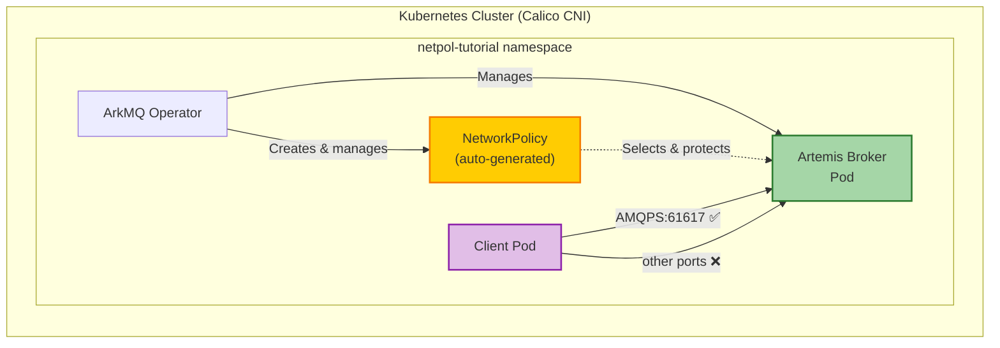
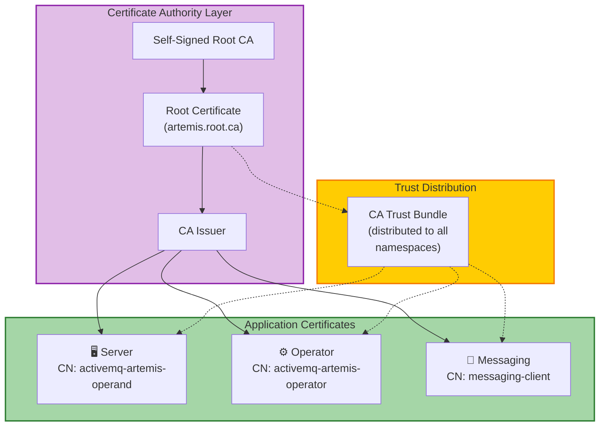

This tutorial shows how the Artemis Operator automatically creates a
[NetworkPolicy](https://kubernetes.io/docs/concepts/services-networking/network-policies/)
for every broker it manages, and how to extend that policy when you configure
additional ports through broker properties as well as even more restrictive
policies such as limiting the source of inbound traffic.

**What is a NetworkPolicy?** A Kubernetes NetworkPolicy is an L3/L4 firewall for
pods. It controls which traffic is allowed to reach a pod and which is not. When
at least one NetworkPolicy selects a pod, all ingress traffic not explicitly
allowed by a rule is denied.

**Why does the operator create one?** To comply with security initiatives that
require every workload to have a NetworkPolicy restricting ingress to only the
ports it actually needs. The operator knows which ports it manages (the headless
service defaults, acceptors, and connectors declared in the CR) and generates
the policy accordingly.

**What about broker properties?** Ports configured solely through broker
properties are opaque to the operator. The operator cannot reliably parse them,
so it does **not** open those ports automatically. If you define additional
acceptors via broker properties, you must use a
[ResourceTemplate](../help/operator.md#configuring-resourcetemplates) to tell
the operator to patch the NetworkPolicy with those extra ports.

This tutorial covers: starting a cluster with a CNI that enforces
NetworkPolicies, setting up a PKI with cert-manager, deploying a locked-down
broker with a broker-properties acceptor and a ResourceTemplate, verifying all
five status conditions are `True`, and producing/consuming messages from a
separate client pod to prove the NetworkPolicy is correctly configured.

## Table of Contents

* [Architecture Overview](#architecture-overview)
* [Prerequisites](#prerequisites)
* [Install the dependencies](#install-the-dependencies)
* [Create Certificate Authority and Issuers](#create-certificate-authority-and-issuers)
* [Deploy the Broker](#deploy-the-broker)
* [Verify the NetworkPolicy](#verify-the-networkpolicy)
* [Exchange Messages](#exchange-messages)
* [Verify NetworkPolicy Enforcement](#verify-networkpolicy-enforcement)
* [Troubleshooting](#troubleshooting)
* [Cleanup](#cleanup)
* [Conclusion](#conclusion)

## Architecture Overview

### NetworkPolicy Flow

This diagram shows how the operator-generated NetworkPolicy restricts ingress
to the broker pod, allowing only the declared ports:



### Certificate Infrastructure

Identical to the [Prometheus locked-down tutorial](prometheus_locked_down.md),
we use cert-manager to build a chain of trust:



## Prerequisites

### Required Tools

* **kubectl** v1.28+ - Kubernetes command-line tool
* **helm** v3.12+ - Package manager for Kubernetes
* **minikube** v1.30+ (or alternatives like [kind](https://kind.sigs.k8s.io/)
  v0.20+, [k3s](https://k3s.io/))

### Minimum System Resources

* **CPU:** 4 cores minimum
* **RAM:** 8GB minimum (minikube will use ~6GB)
* **Disk:** 20GB free space

### Kubernetes Cluster

You need access to a running Kubernetes cluster **with a CNI plugin that
enforces NetworkPolicies**. The default minikube CNI (`bridge`/`kindnet`) does
**not** enforce NetworkPolicies. This tutorial uses Calico.

> **Important**: Without a NetworkPolicy-enforcing CNI, the NetworkPolicy
> resources will exist in the cluster but have no effect. All traffic will be
> allowed regardless of the rules.

### Start minikube with Calico

Start minikube with the `--cni=calico` flag so that NetworkPolicies are
actually enforced:

```{"stage":"init", "id":"minikube_start"}
minikube start --profile netpol-tutorial --memory=6000 --cpus=2 --cni=calico
minikube profile netpol-tutorial
kubectl config use-context netpol-tutorial
```
```shell markdown_runner
* [netpol-tutorial] minikube v1.37.0 on Fedora 43
  - MINIKUBE_ROOTLESS=true
* Automatically selected the kvm2 driver. Other choices: podman, qemu2, ssh
* Starting "netpol-tutorial" primary control-plane node in "netpol-tutorial" cluster
* Configuring Calico (Container Networking Interface) ...
* Verifying Kubernetes components...
  - Using image gcr.io/k8s-minikube/storage-provisioner:v5
* Enabled addons: default-storageclass, storage-provisioner
* Done! kubectl is now configured to use "netpol-tutorial" cluster and "default" namespace by default
* minikube profile was successfully set to netpol-tutorial
Switched to context "netpol-tutorial".
```

Wait for Calico to be fully operational. A short pause is needed because
the Calico DaemonSet pods may not exist immediately after `minikube start`
returns:

```{"stage":"init", "runtime":"bash", "label":"wait for calico"}
until kubectl get pod -l k8s-app=calico-node -n kube-system 2>/dev/null | grep -q calico; do sleep 2; done
kubectl wait pod -l k8s-app=calico-node -n kube-system --for=condition=Ready --timeout=300s
kubectl wait pod -l k8s-app=calico-kube-controllers -n kube-system --for=condition=Ready --timeout=300s
```
```shell markdown_runner
pod/calico-node-hlnjk condition met
pod/calico-kube-controllers-59556d9b4c-gtv5p condition met
+ grep -q calico
+ kubectl get pod -l k8s-app=calico-node -n kube-system
+ sleep 2
+ kubectl get pod -l k8s-app=calico-node -n kube-system
+ grep -q calico
+ sleep 2
+ kubectl get pod -l k8s-app=calico-node -n kube-system
+ grep -q calico
+ kubectl wait pod -l k8s-app=calico-node -n kube-system --for=condition=Ready --timeout=300s
+ kubectl wait pod -l k8s-app=calico-kube-controllers -n kube-system --for=condition=Ready --timeout=300s
+ echo '### ENV ###'
+ printenv
```

### Create the namespace

All resources for this tutorial will be created in the `netpol-tutorial`
namespace.

```{"stage":"init", "runtime":"bash", "label":"create the namespace"}
kubectl create namespace netpol-tutorial
kubectl config set-context --current --namespace=netpol-tutorial
until kubectl get serviceaccount default -n netpol-tutorial &> /dev/null; do sleep 1; done
```
```shell markdown_runner
namespace/netpol-tutorial created
Context "netpol-tutorial" modified.
+ kubectl create namespace netpol-tutorial
+ kubectl config set-context --current --namespace=netpol-tutorial
+ kubectl get serviceaccount default -n netpol-tutorial
+ echo '### ENV ###'
+ printenv
```

### Deploy the Operator

Go to the root of the operator repo and install it into the `netpol-tutorial`
namespace.

```{"stage":"init", "rootdir":"$initial_dir"}
./deploy/install_opr.sh
```
```shell markdown_runner
Deploying operator to watch single namespace
Client Version: 4.18.5
Kustomize Version: v5.4.2
Kubernetes Version: v1.34.0
customresourcedefinition.apiextensions.k8s.io/activemqartemises.broker.amq.io created
customresourcedefinition.apiextensions.k8s.io/activemqartemisaddresses.broker.amq.io created
customresourcedefinition.apiextensions.k8s.io/activemqartemisscaledowns.broker.amq.io created
customresourcedefinition.apiextensions.k8s.io/activemqartemissecurities.broker.amq.io created
customresourcedefinition.apiextensions.k8s.io/brokers.arkmq.org created
customresourcedefinition.apiextensions.k8s.io/brokerapps.arkmq.org created
customresourcedefinition.apiextensions.k8s.io/brokerservices.arkmq.org created
serviceaccount/arkmq-org-broker-controller-manager created
role.rbac.authorization.k8s.io/arkmq-org-broker-operator-role created
rolebinding.rbac.authorization.k8s.io/arkmq-org-broker-operator-rolebinding created
role.rbac.authorization.k8s.io/arkmq-org-broker-leader-election-role created
rolebinding.rbac.authorization.k8s.io/arkmq-org-broker-leader-election-rolebinding created
networkpolicy.networking.k8s.io/arkmq-org-broker-controller-manager-netpol created
deployment.apps/arkmq-org-broker-controller-manager created
Warning: unrecognized format "int32"
Warning: unrecognized format "int64"
```

Wait for the Operator to start (status: `running`).

```{"stage":"init", "label":"wait for the operator to be running"}
kubectl wait deployment arkmq-org-broker-controller-manager --for=create --timeout=240s
kubectl wait pod --all --for=condition=Ready --namespace=netpol-tutorial --timeout=600s
```
```shell markdown_runner
deployment.apps/arkmq-org-broker-controller-manager condition met
pod/arkmq-org-broker-controller-manager-7bc7d7b7b-wk7wx condition met
```

## Install the dependencies

### Install Cert-Manager

```{"stage":"certs"}
kubectl apply -f https://github.com/cert-manager/cert-manager/releases/download/v1.13.2/cert-manager.yaml
```
```shell markdown_runner
namespace/cert-manager created
customresourcedefinition.apiextensions.k8s.io/certificaterequests.cert-manager.io created
customresourcedefinition.apiextensions.k8s.io/certificates.cert-manager.io created
customresourcedefinition.apiextensions.k8s.io/challenges.acme.cert-manager.io created
customresourcedefinition.apiextensions.k8s.io/clusterissuers.cert-manager.io created
customresourcedefinition.apiextensions.k8s.io/issuers.cert-manager.io created
customresourcedefinition.apiextensions.k8s.io/orders.acme.cert-manager.io created
serviceaccount/cert-manager-cainjector created
serviceaccount/cert-manager created
serviceaccount/cert-manager-webhook created
configmap/cert-manager created
configmap/cert-manager-webhook created
clusterrole.rbac.authorization.k8s.io/cert-manager-cainjector created
clusterrole.rbac.authorization.k8s.io/cert-manager-controller-issuers created
clusterrole.rbac.authorization.k8s.io/cert-manager-controller-clusterissuers created
clusterrole.rbac.authorization.k8s.io/cert-manager-controller-certificates created
clusterrole.rbac.authorization.k8s.io/cert-manager-controller-orders created
clusterrole.rbac.authorization.k8s.io/cert-manager-controller-challenges created
clusterrole.rbac.authorization.k8s.io/cert-manager-controller-ingress-shim created
clusterrole.rbac.authorization.k8s.io/cert-manager-cluster-view created
clusterrole.rbac.authorization.k8s.io/cert-manager-view created
clusterrole.rbac.authorization.k8s.io/cert-manager-edit created
clusterrole.rbac.authorization.k8s.io/cert-manager-controller-approve:cert-manager-io created
clusterrole.rbac.authorization.k8s.io/cert-manager-controller-certificatesigningrequests created
clusterrole.rbac.authorization.k8s.io/cert-manager-webhook:subjectaccessreviews created
clusterrolebinding.rbac.authorization.k8s.io/cert-manager-cainjector created
clusterrolebinding.rbac.authorization.k8s.io/cert-manager-controller-issuers created
clusterrolebinding.rbac.authorization.k8s.io/cert-manager-controller-clusterissuers created
clusterrolebinding.rbac.authorization.k8s.io/cert-manager-controller-certificates created
clusterrolebinding.rbac.authorization.k8s.io/cert-manager-controller-orders created
clusterrolebinding.rbac.authorization.k8s.io/cert-manager-controller-challenges created
clusterrolebinding.rbac.authorization.k8s.io/cert-manager-controller-ingress-shim created
clusterrolebinding.rbac.authorization.k8s.io/cert-manager-controller-approve:cert-manager-io created
clusterrolebinding.rbac.authorization.k8s.io/cert-manager-controller-certificatesigningrequests created
clusterrolebinding.rbac.authorization.k8s.io/cert-manager-webhook:subjectaccessreviews created
role.rbac.authorization.k8s.io/cert-manager-cainjector:leaderelection created
role.rbac.authorization.k8s.io/cert-manager:leaderelection created
role.rbac.authorization.k8s.io/cert-manager-webhook:dynamic-serving created
rolebinding.rbac.authorization.k8s.io/cert-manager-cainjector:leaderelection created
rolebinding.rbac.authorization.k8s.io/cert-manager:leaderelection created
rolebinding.rbac.authorization.k8s.io/cert-manager-webhook:dynamic-serving created
service/cert-manager created
service/cert-manager-webhook created
deployment.apps/cert-manager-cainjector created
deployment.apps/cert-manager created
deployment.apps/cert-manager-webhook created
mutatingwebhookconfiguration.admissionregistration.k8s.io/cert-manager-webhook created
validatingwebhookconfiguration.admissionregistration.k8s.io/cert-manager-webhook created
Warning: unrecognized format "int32"
Warning: unrecognized format "int64"
```

Wait for `cert-manager` to be ready.

```{"stage":"certs", "label":"wait for cert-manager"}
kubectl wait pod --all --for=condition=Ready --namespace=cert-manager --timeout=600s
```
```shell markdown_runner
pod/cert-manager-5c994d7f66-vt5m8 condition met
pod/cert-manager-cainjector-7f656b4cf5-v6lws condition met
pod/cert-manager-webhook-5f65679fbf-p9vdz condition met
```

### Install Trust Manager

```bash {"stage":"init", "label":"add jetstack helm repo", "runtime":"bash"}
helm repo add jetstack https://charts.jetstack.io --force-update
```
```shell markdown_runner
"jetstack" has been added to your repositories
+ helm repo add jetstack https://charts.jetstack.io --force-update
+ echo '### ENV ###'
+ printenv
```

```bash {"stage":"init", "label":"install trust-manager", "runtime":"bash"}
helm upgrade trust-manager jetstack/trust-manager --install --namespace cert-manager --set secretTargets.enabled=true --set secretTargets.authorizedSecretsAll=true --wait
```
```shell markdown_runner
Release "trust-manager" does not exist. Installing it now.
NAME: trust-manager
LAST DEPLOYED: Tue Apr 14 16:01:29 2026
NAMESPACE: cert-manager
STATUS: deployed
REVISION: 1
TEST SUITE: None
NOTES:
⚠️  WARNING: Consider increasing the Helm value `replicaCount` to 2 if you require high availability.
⚠️  WARNING: Consider setting the Helm value `podDisruptionBudget.enabled` to true if you require high availability.

trust-manager v0.22.0 has been deployed successfully!
Your installation includes a default CA package, using the following
default CA package image:

:

It's imperative that you keep the default CA package image up to date.
To find out more about securely running trust-manager and to get started
with creating your first bundle, check out the documentation on the
cert-manager website:

https://cert-manager.io/docs/projects/trust-manager/
+ helm upgrade trust-manager jetstack/trust-manager --install --namespace cert-manager --set secretTargets.enabled=true --set secretTargets.authorizedSecretsAll=true --wait
I0414 16:01:29.890462  393579 warnings.go:110] "Warning: unrecognized format \"int64\""
+ echo '### ENV ###'
+ printenv
```

Wait for `trust bundles crd` to be ready.

```{"stage":"certs", "label":"wait for trust-bundles-crd creation"}
kubectl wait crd bundles.trust.cert-manager.io --for=create --timeout=240s
kubectl wait pod --all --for=condition=Ready --namespace=cert-manager --timeout=600s
```
```shell markdown_runner
customresourcedefinition.apiextensions.k8s.io/bundles.trust.cert-manager.io condition met
pod/cert-manager-5c994d7f66-vt5m8 condition met
pod/cert-manager-cainjector-7f656b4cf5-v6lws condition met
pod/cert-manager-webhook-5f65679fbf-p9vdz condition met
pod/trust-manager-c55bfb775-tjrxb condition met
```

## Create Certificate Authority and Issuers

This section is identical to the
[Prometheus locked-down tutorial](prometheus_locked_down.md#create-certificate-authority-and-issuers).
We create a self-signed root CA, distribute it via trust-manager, and create a
ClusterIssuer that signs all our certificates.

### Create a Root CA

```{"stage":"certs", "runtime":"bash", "label":"create root issuer"}
kubectl apply -f - <<EOF
apiVersion: cert-manager.io/v1
kind: ClusterIssuer
metadata:
  name: selfsigned-root-issuer
spec:
  selfSigned: {}
EOF
```
```shell markdown_runner
clusterissuer.cert-manager.io/selfsigned-root-issuer created
+ kubectl apply -f -
+ echo '### ENV ###'
+ printenv
```

```{"stage":"certs", "runtime":"bash", "label":"create root certificate"}
kubectl apply -f - <<EOF
apiVersion: cert-manager.io/v1
kind: Certificate
metadata:
  name: root-ca
  namespace: cert-manager
spec:
  isCA: true
  commonName: artemis.root.ca
  secretName: root-ca-secret
  issuerRef:
    name: selfsigned-root-issuer
    kind: ClusterIssuer
    group: cert-manager.io
EOF
```
```shell markdown_runner
certificate.cert-manager.io/root-ca created
+ kubectl apply -f -
+ echo '### ENV ###'
+ printenv
```

```bash {"stage":"certs", "label":"wait for root-ca ready", "runtime":"bash"}
kubectl wait certificate root-ca -n cert-manager --for=condition=Ready --timeout=300s
```
```shell markdown_runner
certificate.cert-manager.io/root-ca condition met
+ kubectl wait certificate root-ca -n cert-manager --for=condition=Ready --timeout=300s
+ echo '### ENV ###'
+ printenv
```

### Create a CA Bundle

The trust-manager webhook may take a moment to start accepting requests after
the pod is `Ready`. The `until` loop retries until the webhook responds.

```bash {"stage":"certs", "label":"create ca bundle", "runtime":"bash"}
until kubectl apply -f - <<EOF
apiVersion: trust.cert-manager.io/v1alpha1
kind: Bundle
metadata:
  name: activemq-artemis-manager-ca
  namespace: cert-manager
spec:
  sources:
  - secret:
      name: root-ca-secret
      key: "tls.crt"
  target:
    secret:
      key: "ca.pem"
EOF
do echo "Waiting for trust-manager webhook..." && sleep 5; done
```
```shell markdown_runner
Waiting for trust-manager webhook...
bundle.trust.cert-manager.io/activemq-artemis-manager-ca created
+ kubectl apply -f -
Error from server (InternalError): error when creating "STDIN": Internal error occurred: failed calling webhook "trust.cert-manager.io": failed to call webhook: Post "https://trust-manager.cert-manager.svc:443/validate-trust-cert-manager-io-v1alpha1-bundle?timeout=5s": dial tcp 10.100.249.142:443: connect: connection refused
+ echo 'Waiting for trust-manager webhook...'
+ sleep 5
+ kubectl apply -f -
+ echo '### ENV ###'
+ printenv
```

```bash {"stage":"certs", "label":"wait for ca bundle", "runtime":"bash"}
kubectl wait bundle activemq-artemis-manager-ca -n cert-manager --for=condition=Synced --timeout=300s
```
```shell markdown_runner
bundle.trust.cert-manager.io/activemq-artemis-manager-ca condition met
+ kubectl wait bundle activemq-artemis-manager-ca -n cert-manager --for=condition=Synced --timeout=300s
+ echo '### ENV ###'
+ printenv
```

### Create a Cluster Issuer

```{"stage":"certs", "runtime":"bash", "label":"create ca issuer"}
kubectl apply -f - <<EOF
apiVersion: cert-manager.io/v1
kind: ClusterIssuer
metadata:
  name: ca-issuer
spec:
  ca:
    secretName: root-ca-secret
EOF
```
```shell markdown_runner
clusterissuer.cert-manager.io/ca-issuer created
+ kubectl apply -f -
+ echo '### ENV ###'
+ printenv
```

## Deploy the Broker

### Create Broker and Client Certificates

We need two certificates:

1. A server certificate for the broker pod (`broker-cert`)
2. A client certificate for the operator to authenticate with the broker
   (`activemq-artemis-manager-cert`)

```{"stage":"deploy", "runtime":"bash", "label":"create broker and client certs"}
kubectl apply -f - <<EOF
---
apiVersion: cert-manager.io/v1
kind: Certificate
metadata:
  name: broker-cert
  namespace: netpol-tutorial
spec:
  secretName: broker-cert
  commonName: activemq-artemis-operand
  dnsNames:
    - artemis-broker-ss-0.artemis-broker-hdls-svc.netpol-tutorial.svc.cluster.local
    - '*.artemis-broker-hdls-svc.netpol-tutorial.svc.cluster.local'
    - artemis-broker-messaging-svc.cluster.local
    - artemis-broker-messaging-svc
  issuerRef:
    name: ca-issuer
    kind: ClusterIssuer
---
apiVersion: cert-manager.io/v1
kind: Certificate
metadata:
  name: activemq-artemis-manager-cert
  namespace: netpol-tutorial
spec:
  secretName: activemq-artemis-manager-cert
  commonName: activemq-artemis-operator
  issuerRef:
    name: ca-issuer
    kind: ClusterIssuer
EOF
```
```shell markdown_runner
certificate.cert-manager.io/broker-cert created
certificate.cert-manager.io/activemq-artemis-manager-cert created
+ kubectl apply -f -
+ echo '### ENV ###'
+ printenv
```

Wait for the secrets to be created.

```{"stage":"deploy", "runtime":"bash", "label":"wait for secrets"}
kubectl wait --for=condition=Ready certificate broker-cert -n netpol-tutorial --timeout=300s
kubectl wait --for=condition=Ready certificate activemq-artemis-manager-cert -n netpol-tutorial --timeout=300s
```
```shell markdown_runner
certificate.cert-manager.io/broker-cert condition met
certificate.cert-manager.io/activemq-artemis-manager-cert condition met
+ kubectl wait --for=condition=Ready certificate broker-cert -n netpol-tutorial --timeout=300s
+ kubectl wait --for=condition=Ready certificate activemq-artemis-manager-cert -n netpol-tutorial --timeout=300s
+ echo '### ENV ###'
+ printenv
```

### Create the AMQPS acceptor TLS configuration

Create a PEMCFG file that tells the broker where to find its TLS certificate and
key for the AMQPS acceptor.

```bash {"stage":"deploy", "label":"acceptor pemcfg secret", "runtime":"bash"}
kubectl apply -f - <<EOF
apiVersion: v1
kind: Secret
metadata:
  name: amqps-pem
  namespace: netpol-tutorial
type: Opaque
stringData:
  _amqps.pemcfg: |
    source.key=/amq/extra/secrets/broker-cert/tls.key
    source.cert=/amq/extra/secrets/broker-cert/tls.crt
EOF
```
```shell markdown_runner
secret/amqps-pem created
+ kubectl apply -f -
+ echo '### ENV ###'
+ printenv
```

### Create the JAAS configuration for messaging clients

Create two secrets for the JAAS login module:

1. **`artemis-broker-jaas-creds`** - Contains the JAAS credential mapping files
   (`cert-users` and `cert-roles`). These are plain text files, **not** broker
   properties, so they must live in a separate secret without the `-bp` suffix.
   Placing them in a `-bp` secret would cause the operator to treat them as
   broker-property files and report `BrokerPropertiesApplied: Unknown`.

2. **`artemis-broker-jaas-config-bp`** - Contains the broker properties that
   configure the JAAS login module. The `-bp` suffix tells the operator to apply
   these.

```{"stage":"deploy", "runtime":"bash", "label":"create jaas creds secret"}
kubectl apply -f - <<'EOF'
apiVersion: v1
kind: Secret
metadata:
  name: artemis-broker-jaas-creds
  namespace: netpol-tutorial
stringData:
  cert-users: "messaging-client=/.*messaging-client.*/"
  cert-roles: "messaging=messaging-client"
EOF
```
```shell markdown_runner
secret/artemis-broker-jaas-creds created
+ kubectl apply -f -
+ echo '### ENV ###'
+ printenv
```

```{"stage":"deploy", "runtime":"bash", "label":"create jaas config bp secret"}
kubectl apply -f - <<'EOF'
apiVersion: v1
kind: Secret
metadata:
  name: artemis-broker-jaas-config-bp
  namespace: netpol-tutorial
stringData:
  jaas-config-bp.properties: |
    jaasConfigs."activemq".modules.cert.loginModuleClass=org.apache.activemq.artemis.spi.core.security.jaas.TextFileCertificateLoginModule
    jaasConfigs."activemq".modules.cert.controlFlag=required
    jaasConfigs."activemq".modules.cert.params.debug=true
    jaasConfigs."activemq".modules.cert.params."org.apache.activemq.jaas.textfiledn.role"=cert-roles
    jaasConfigs."activemq".modules.cert.params."org.apache.activemq.jaas.textfiledn.user"=cert-users
    jaasConfigs."activemq".modules.cert.params.baseDir=/amq/extra/secrets/artemis-broker-jaas-creds
EOF
```
```shell markdown_runner
secret/artemis-broker-jaas-config-bp created
+ kubectl apply -f -
+ echo '### ENV ###'
+ printenv
```

### Deploy the Broker Custom Resource

Now deploy the `Broker` custom resource. This broker has:

* `restricted: true` for certificate-based authentication
* An AMQPS acceptor on port **61617** configured entirely through **broker
  properties**
* A **ResourceTemplate** that patches the operator-generated NetworkPolicy to
  open port 61617 and restrict Jolokia to the operator pod only

**Why the ResourceTemplate?** The operator generates a NetworkPolicy with only
the ports it knows about from the CR's explicit fields (headless service
defaults, `spec.acceptors`, `spec.connectors`). Ports defined solely through
broker properties are invisible to the operator. The ResourceTemplate patches
the NetworkPolicy to include port 61617. Also by default the network policy
doesn't restrict what pod is allowed to access a given port, we're using this
template as an opportunity to demonstrate the advanced capabilities offered by
the network policies.

**Important:** ResourceTemplate patches on `spec.ingress` **replace** the entire
list (there is no merge key on `NetworkPolicyIngressRule`). You must therefore
list **all** desired ingress rules in the patch, not just the extra one.

The default ports for a non-restricted broker are:

| Port  | Service            |
|-------|--------------------|
| 7800  | JGroups clustering |
| 8161  | Console / Jolokia (limiting access from the operator pod)  |
| 8778  | Jolokia agent      |
| 61616 | All protocols      |

Since we use `restricted: true`, the operator's base NetworkPolicy only opens
8778 (Jolokia) and 8888 (Prometheus). The ResourceTemplate replaces those rules
with three entries:

* **8778 (Jolokia)** -- restricted via a `from` pod selector so that only the
  operator pod (`control-plane: controller-manager`) can reach it
* **8888 (Prometheus)** -- open to any source (all namespaces and external traffic)
* **61617 (AMQPS acceptor)** -- open to any source (all namespaces and external traffic)

```{"stage":"deploy", "runtime":"bash", "label":"deploy broker cr"}
kubectl apply -f - <<'EOF'
apiVersion: broker.arkmq.org/v1beta2
kind: Broker
metadata:
  name: artemis-broker
  namespace: netpol-tutorial
spec:
  restricted: true
  brokerProperties:
    - "messageCounterSamplePeriod=500"
    # Create a queue for messaging
    - "addressConfigurations.APP_JOBS.routingTypes=ANYCAST"
    - "addressConfigurations.APP_JOBS.queueConfigs.APP_JOBS.routingType=ANYCAST"
    # Define a new 'messaging' role with permissions for the APP_JOBS address
    - "securityRoles.APP_JOBS.messaging.browse=true"
    - "securityRoles.APP_JOBS.messaging.consume=true"
    - "securityRoles.APP_JOBS.messaging.send=true"
    - "securityRoles.APP_JOBS.messaging.view=true"
    # AMQPS acceptor configured via broker properties (not CR spec.acceptors)
    - "acceptorConfigurations.\"amqps\".factoryClassName=org.apache.activemq.artemis.core.remoting.impl.netty.NettyAcceptorFactory"
    - "acceptorConfigurations.\"amqps\".params.host=0.0.0.0"
    - "acceptorConfigurations.\"amqps\".params.port=61617"
    - "acceptorConfigurations.\"amqps\".params.protocols=amqp"
    - "acceptorConfigurations.\"amqps\".params.securityDomain=activemq"
    - "acceptorConfigurations.\"amqps\".params.sslEnabled=true"
    - "acceptorConfigurations.\"amqps\".params.needClientAuth=true"
    - "acceptorConfigurations.\"amqps\".params.saslMechanisms=EXTERNAL"
    - "acceptorConfigurations.\"amqps\".params.keyStoreType=PEMCFG"
    - "acceptorConfigurations.\"amqps\".params.keyStorePath=/amq/extra/secrets/amqps-pem/_amqps.pemcfg"
    - "acceptorConfigurations.\"amqps\".params.trustStoreType=PEMCA"
    - "acceptorConfigurations.\"amqps\".params.trustStorePath=/amq/extra/secrets/activemq-artemis-manager-ca/ca.pem"
  deploymentPlan:
    extraMounts:
      secrets: [artemis-broker-jaas-config-bp, artemis-broker-jaas-creds, amqps-pem]
  resourceTemplates:
    - selector:
        kind: NetworkPolicy
      # This patch REPLACES the entire spec.ingress list because
      # NetworkPolicyIngressRule has no strategic merge key.
      # All desired ports must be listed -- not just the extra one.
      patch:
        kind: NetworkPolicy
        apiVersion: networking.k8s.io/v1
        spec:
          ingress:
            # Jolokia: only the operator pod may reach it
            - from:
                - podSelector:
                    matchLabels:
                      control-plane: controller-manager
                      name: arkmq-org-broker-operator
              ports:
                - port: 8778
                  protocol: TCP
            # Prometheus agent + AMQPS acceptor: open to any source (all namespaces + external)
            - ports:
                - port: 8888
                  protocol: TCP
                - port: 61617
                  protocol: TCP
EOF
```
```shell markdown_runner
broker.arkmq.org/artemis-broker created
+ kubectl apply -f -
+ echo '### ENV ###'
+ printenv
```

Wait for the broker to be ready.

```{"stage":"deploy"}
kubectl wait Broker artemis-broker --for=condition=Ready --namespace=netpol-tutorial --timeout=300s
```
```shell markdown_runner
broker.arkmq.org/artemis-broker condition met
```

## Verify the NetworkPolicy

### Check all five status conditions

A healthy broker should have all five conditions set to `True`:

* **Valid** - CR passed validation
* **Deployed** - All pods are ready
* **Ready** - Resource is fully ready
* **BrokerPropertiesApplied** - Broker properties configuration applied
* **BrokerVersionAligned** - Broker image version matches the operator's known versions

Some conditions take a few reconciliation cycles to transition from `Unknown`
to `True`, so we poll until they settle.

```{"stage":"verify", "runtime":"bash", "label":"assert all conditions true"}
TIMEOUT=120
INTERVAL=5
ELAPSED=0

while [ $ELAPSED -lt $TIMEOUT ]; do
  CONDITIONS=$(kubectl get Broker artemis-broker -n netpol-tutorial -o json \
    | jq -r '.status.conditions[] | "\(.type): \(.status)"')
  TOTAL_COUNT=$(echo "$CONDITIONS" | wc -l)
  TRUE_COUNT=$(echo "$CONDITIONS" | grep -c "True" || true)

  if [ "$TOTAL_COUNT" -gt 0 ] && [ "$TRUE_COUNT" -eq "$TOTAL_COUNT" ]; then
    echo "$CONDITIONS"
    echo ""
    echo "Status: ${TRUE_COUNT}/${TOTAL_COUNT} conditions True"
    echo "All conditions are True"
    exit 0
  fi

  echo "  ${TRUE_COUNT}/${TOTAL_COUNT} True so far, retrying in ${INTERVAL}s..."
  sleep $INTERVAL
  ELAPSED=$((ELAPSED + INTERVAL))
done

echo ""
echo "Final state after ${TIMEOUT}s:"
echo "$CONDITIONS"
echo ""
echo "ERROR: Not all conditions became True within ${TIMEOUT}s (${TRUE_COUNT}/${TOTAL_COUNT})"
exit 1
```
```shell markdown_runner
  3/4 True so far, retrying in 5s...
  3/5 True so far, retrying in 5s...
  3/5 True so far, retrying in 5s...
  3/5 True so far, retrying in 5s...
Valid: True
BrokerPropertiesApplied: True
Deployed: True
Ready: True
BrokerVersionAligned: True

Status: 5/5 conditions True
All conditions are True

+ TIMEOUT=120
+ INTERVAL=5
+ ELAPSED=0
+ '[' 0 -lt 120 ']'
++ kubectl get Broker artemis-broker -n netpol-tutorial -o json
++ jq -r '.status.conditions[] | "\(.type): \(.status)"'
+ CONDITIONS=$'Valid: True\nBrokerPropertiesApplied: Unknown\nDeployed: True\nReady: True'
++ echo $'Valid: True\nBrokerPropertiesApplied: Unknown\nDeployed: True\nReady: True'
++ wc -l
+ TOTAL_COUNT=4
++ echo $'Valid: True\nBrokerPropertiesApplied: Unknown\nDeployed: True\nReady: True'
++ grep -c True
+ TRUE_COUNT=3
+ '[' 4 -gt 0 ']'
+ '[' 3 -eq 4 ']'
+ echo '  3/4 True so far, retrying in 5s...'
+ sleep 5
+ ELAPSED=5
+ '[' 5 -lt 120 ']'
++ kubectl get Broker artemis-broker -n netpol-tutorial -o json
++ jq -r '.status.conditions[] | "\(.type): \(.status)"'
+ CONDITIONS=$'Valid: True\nBrokerPropertiesApplied: Unknown\nDeployed: True\nReady: True\nBrokerVersionAligned: Unknown'
++ echo $'Valid: True\nBrokerPropertiesApplied: Unknown\nDeployed: True\nReady: True\nBrokerVersionAligned: Unknown'
++ wc -l
+ TOTAL_COUNT=5
++ echo $'Valid: True\nBrokerPropertiesApplied: Unknown\nDeployed: True\nReady: True\nBrokerVersionAligned: Unknown'
++ grep -c True
+ TRUE_COUNT=3
+ '[' 5 -gt 0 ']'
+ '[' 3 -eq 5 ']'
+ echo '  3/5 True so far, retrying in 5s...'
+ sleep 5
+ ELAPSED=10
+ '[' 10 -lt 120 ']'
++ kubectl get Broker artemis-broker -n netpol-tutorial -o json
++ jq -r '.status.conditions[] | "\(.type): \(.status)"'
+ CONDITIONS=$'Valid: True\nBrokerPropertiesApplied: Unknown\nDeployed: True\nReady: True\nBrokerVersionAligned: Unknown'
++ echo $'Valid: True\nBrokerPropertiesApplied: Unknown\nDeployed: True\nReady: True\nBrokerVersionAligned: Unknown'
++ wc -l
+ TOTAL_COUNT=5
++ echo $'Valid: True\nBrokerPropertiesApplied: Unknown\nDeployed: True\nReady: True\nBrokerVersionAligned: Unknown'
++ grep -c True
+ TRUE_COUNT=3
+ '[' 5 -gt 0 ']'
+ '[' 3 -eq 5 ']'
+ echo '  3/5 True so far, retrying in 5s...'
+ sleep 5
+ ELAPSED=15
+ '[' 15 -lt 120 ']'
++ kubectl get Broker artemis-broker -n netpol-tutorial -o json
++ jq -r '.status.conditions[] | "\(.type): \(.status)"'
+ CONDITIONS=$'Valid: True\nBrokerPropertiesApplied: Unknown\nDeployed: True\nReady: True\nBrokerVersionAligned: Unknown'
++ echo $'Valid: True\nBrokerPropertiesApplied: Unknown\nDeployed: True\nReady: True\nBrokerVersionAligned: Unknown'
++ wc -l
+ TOTAL_COUNT=5
++ echo $'Valid: True\nBrokerPropertiesApplied: Unknown\nDeployed: True\nReady: True\nBrokerVersionAligned: Unknown'
++ grep -c True
+ TRUE_COUNT=3
+ '[' 5 -gt 0 ']'
+ '[' 3 -eq 5 ']'
+ echo '  3/5 True so far, retrying in 5s...'
+ sleep 5
+ ELAPSED=20
+ '[' 20 -lt 120 ']'
++ kubectl get Broker artemis-broker -n netpol-tutorial -o json
++ jq -r '.status.conditions[] | "\(.type): \(.status)"'
+ CONDITIONS=$'Valid: True\nBrokerPropertiesApplied: True\nDeployed: True\nReady: True\nBrokerVersionAligned: True'
++ echo $'Valid: True\nBrokerPropertiesApplied: True\nDeployed: True\nReady: True\nBrokerVersionAligned: True'
++ wc -l
+ TOTAL_COUNT=5
++ echo $'Valid: True\nBrokerPropertiesApplied: True\nDeployed: True\nReady: True\nBrokerVersionAligned: True'
++ grep -c True
+ TRUE_COUNT=5
+ '[' 5 -gt 0 ']'
+ '[' 5 -eq 5 ']'
+ echo $'Valid: True\nBrokerPropertiesApplied: True\nDeployed: True\nReady: True\nBrokerVersionAligned: True'
+ echo ''
+ echo 'Status: 5/5 conditions True'
+ echo 'All conditions are True'
+ exit 0
```

### Inspect the generated NetworkPolicy

The operator created a NetworkPolicy named `artemis-broker-netpol` that
restricts ingress to the broker pods. The ResourceTemplate has patched it to
include port 61617 alongside the restricted-mode defaults.

```{"stage":"verify", "runtime":"bash", "label":"inspect network policy"}
kubectl get networkpolicy artemis-broker-netpol -n netpol-tutorial -o yaml
```
```shell markdown_runner
apiVersion: networking.k8s.io/v1
kind: NetworkPolicy
metadata:
  creationTimestamp: "2026-04-14T14:01:53Z"
  generation: 1
  name: artemis-broker-netpol
  namespace: netpol-tutorial
  ownerReferences:
  - apiVersion: broker.arkmq.org/v1beta2
    controller: true
    kind: Broker
    name: artemis-broker
    uid: cb99f033-158c-496e-9827-8f156c25b97e
  resourceVersion: "1121"
  uid: 87e03ea2-07c1-4bf0-865c-6531c15cc863
spec:
  ingress:
  - from:
    - podSelector:
        matchLabels:
          control-plane: controller-manager
          name: arkmq-org-broker-operator
    ports:
    - port: 8778
      protocol: TCP
  - ports:
    - port: 8888
      protocol: TCP
    - port: 61617
      protocol: TCP
  podSelector:
    matchLabels:
      ActiveMQArtemis: artemis-broker
  policyTypes:
  - Ingress
+ kubectl get networkpolicy artemis-broker-netpol -n netpol-tutorial -o yaml
+ echo '### ENV ###'
+ printenv
```

## Exchange Messages

With the broker running and the NetworkPolicy in place, verify that messaging
works end-to-end from a client pod through the NetworkPolicy-allowed port.

### Create a Client Certificate

Create a dedicated certificate for the messaging client with
`CN=messaging-client`, matching the JAAS configuration.

```{"stage":"messaging", "runtime":"bash", "label":"create client cert"}
kubectl apply -f - <<EOF
apiVersion: cert-manager.io/v1
kind: Certificate
metadata:
  name: messaging-client-cert
  namespace: netpol-tutorial
spec:
  secretName: messaging-client-cert
  commonName: messaging-client
  issuerRef:
    name: ca-issuer
    kind: ClusterIssuer
EOF
```
```shell markdown_runner
certificate.cert-manager.io/messaging-client-cert created
+ kubectl apply -f -
+ echo '### ENV ###'
+ printenv
```

```{"stage":"messaging", "runtime":"bash", "label":"wait for client cert"}
kubectl wait certificate messaging-client-cert -n netpol-tutorial --for=condition=Ready --timeout=300s
```
```shell markdown_runner
certificate.cert-manager.io/messaging-client-cert condition met
+ kubectl wait certificate messaging-client-cert -n netpol-tutorial --for=condition=Ready --timeout=300s
+ echo '### ENV ###'
+ printenv
```

### Create Client Keystore Configuration

```bash {"stage":"messaging", "label":"create pemcfg secret", "runtime":"bash"}
kubectl apply -f - <<EOF
apiVersion: v1
kind: Secret
metadata:
  name: cert-pemcfg
  namespace: netpol-tutorial
type: Opaque
stringData:
  tls.pemcfg: |
    source.key=/app/tls/client/tls.key
    source.cert=/app/tls/client/tls.crt
  java.security: security.provider.6=de.dentrassi.crypto.pem.PemKeyStoreProvider
EOF
```
```shell markdown_runner
secret/cert-pemcfg created
+ kubectl apply -f -
+ echo '### ENV ###'
+ printenv
```

### Expose the Messaging Acceptor

Create a Kubernetes `Service` to expose the broker's AMQPS acceptor port
(`61617`). This is required so the client pods can address the broker by service
name.

```bash {"stage":"messaging", "label":"create messaging service", "runtime":"bash"}
kubectl apply -f - <<EOF
apiVersion: v1
kind: Service
metadata:
  name: artemis-broker-messaging-svc
  namespace: netpol-tutorial
spec:
  selector:
    ActiveMQArtemis: artemis-broker
  ports:
  - name: amqps
    port: 61617
    targetPort: 61617
    protocol: TCP
EOF
```
```shell markdown_runner
service/artemis-broker-messaging-svc created
+ kubectl apply -f -
+ echo '### ENV ###'
+ printenv
```

### Run Producer and Consumer Jobs

Run two Kubernetes `Job`s: one produces 100 messages to the `APP_JOBS` queue,
the other consumes them. Both authenticate using the `messaging-client-cert`
and connect through the NetworkPolicy-allowed port 61617.

```{"stage":"messaging", "runtime":"bash", "label":"get latest broker version"}
export BROKER_VERSION=$(kubectl get Broker artemis-broker --namespace=netpol-tutorial -o json | jq .status.version.brokerVersion -r)
echo "broker version: $BROKER_VERSION"
```
```shell markdown_runner
broker version: 2.53.0
++ kubectl get Broker artemis-broker --namespace=netpol-tutorial -o json
++ jq .status.version.brokerVersion -r
+ export BROKER_VERSION=2.53.0
+ BROKER_VERSION=2.53.0
+ echo 'broker version: 2.53.0'
+ echo '### ENV ###'
+ printenv
```

```bash {"stage":"messaging", "label":"run producer and consumer", "runtime":"bash"}
cat <<'EOT' > deploy.yml
---
apiVersion: batch/v1
kind: Job
metadata:
  name: producer
  namespace: netpol-tutorial
spec:
  template:
    spec:
      containers:
      - name: producer
EOT
cat <<EOT >> deploy.yml
        image: quay.io/arkmq-org/arkmq-org-broker-kubernetes:artemis.${BROKER_VERSION}
EOT
cat <<'EOT' >> deploy.yml
        command:
        - "/bin/sh"
        - "-c"
        - exec java -classpath /opt/amq/lib/*:/opt/amq/lib/extra/* org.apache.activemq.artemis.cli.Artemis producer --protocol=AMQP --url 'amqps://artemis-broker-messaging-svc:61617?transport.trustStoreType=PEMCA&transport.trustStoreLocation=/app/tls/ca/ca.pem&transport.keyStoreType=PEMCFG&transport.keyStoreLocation=/app/tls/pem/tls.pemcfg' --message-count 100 --destination queue://APP_JOBS;
        env:
        - name: JDK_JAVA_OPTIONS
          value: "-Djava.security.properties=/app/tls/pem/java.security"
        volumeMounts:
        - name: trust
          mountPath: /app/tls/ca
        - name: cert
          mountPath: /app/tls/client
        - name: pem
          mountPath: /app/tls/pem
      volumes:
      - name: trust
        secret:
          secretName: activemq-artemis-manager-ca
      - name: cert
        secret:
          secretName: messaging-client-cert
      - name: pem
        secret:
          secretName: cert-pemcfg
      restartPolicy: Never
---
apiVersion: batch/v1
kind: Job
metadata:
  name: consumer
  namespace: netpol-tutorial
spec:
  template:
    spec:
      containers:
      - name: consumer
EOT
cat <<EOT >> deploy.yml
        image: quay.io/arkmq-org/arkmq-org-broker-kubernetes:artemis.${BROKER_VERSION}
EOT
cat <<'EOT' >> deploy.yml
        command:
        - "/bin/sh"
        - "-c"
        - exec java -classpath /opt/amq/lib/*:/opt/amq/lib/extra/* org.apache.activemq.artemis.cli.Artemis consumer --protocol=AMQP --url 'amqps://artemis-broker-messaging-svc:61617?transport.trustStoreType=PEMCA&transport.trustStoreLocation=/app/tls/ca/ca.pem&transport.keyStoreType=PEMCFG&transport.keyStoreLocation=/app/tls/pem/tls.pemcfg' --message-count 100 --destination queue://APP_JOBS --receive-timeout 30000;
        env:
        - name: JDK_JAVA_OPTIONS
          value: "-Djava.security.properties=/app/tls/pem/java.security"
        volumeMounts:
        - name: trust
          mountPath: /app/tls/ca
        - name: cert
          mountPath: /app/tls/client
        - name: pem
          mountPath: /app/tls/pem
      volumes:
      - name: trust
        secret:
          secretName: activemq-artemis-manager-ca
      - name: cert
        secret:
          secretName: messaging-client-cert
      - name: pem
        secret:
          secretName: cert-pemcfg
      restartPolicy: Never
EOT
kubectl apply -f deploy.yml
```
```shell markdown_runner
job.batch/producer created
job.batch/consumer created
+ cat
+ cat
+ cat
+ cat
+ cat
+ kubectl apply -f deploy.yml
+ echo '### ENV ###'
+ printenv
```

Wait for both jobs to complete.

```bash {"stage":"messaging", "label":"wait for jobs"}
kubectl wait job producer -n netpol-tutorial --for=condition=Complete --timeout=240s
kubectl wait job consumer -n netpol-tutorial --for=condition=Complete --timeout=240s
```
```shell markdown_runner
job.batch/producer condition met
job.batch/consumer condition met
```

Verify that all 100 messages were produced and consumed:

```{"stage":"messaging", "runtime":"bash", "label":"verify message counts"}
echo "Producer output:"
kubectl logs job/producer -n netpol-tutorial | tail -3
echo ""
echo "Consumer output:"
kubectl logs job/consumer -n netpol-tutorial | tail -3
```
```shell markdown_runner
Producer output:
Producer APP_JOBS, thread=0 Produced: 100 messages
Producer APP_JOBS, thread=0 Elapsed time in second : 1 s
Producer APP_JOBS, thread=0 Elapsed time in milli second : 1228 milli seconds

Consumer output:
Consumer APP_JOBS, thread=0 Elapsed time in milli second : 354 milli seconds
Consumer APP_JOBS, thread=0 Consumed: 100 messages
Consumer APP_JOBS, thread=0 Consumer thread finished
+ echo 'Producer output:'
+ kubectl logs job/producer -n netpol-tutorial
+ tail -3
+ echo ''
+ echo 'Consumer output:'
+ kubectl logs job/consumer -n netpol-tutorial
+ tail -3
+ echo '### ENV ###'
+ printenv
```

## Verify NetworkPolicy Enforcement

This section confirms that the NetworkPolicy is not just present but actively
enforced by the CNI. We deploy a plain client pod and verify that traffic to a
port **not** in the NetworkPolicy is blocked, while traffic to an allowed port
succeeds.

### Deploy a test client pod

```{"stage":"enforce", "runtime":"bash", "label":"deploy test client pod"}
kubectl apply -f - <<EOF
apiVersion: v1
kind: Pod
metadata:
  name: netpol-test-client
  namespace: netpol-tutorial
spec:
  containers:
  - name: client
    image: registry.access.redhat.com/ubi8/ubi:8.9
    command: ["/bin/bash", "-c", "sleep infinity"]
EOF

kubectl wait pod netpol-test-client -n netpol-tutorial --for=condition=Ready --timeout=120s
```
```shell markdown_runner
pod/netpol-test-client created
pod/netpol-test-client condition met
+ kubectl apply -f -
+ kubectl wait pod netpol-test-client -n netpol-tutorial --for=condition=Ready --timeout=120s
+ echo '### ENV ###'
+ printenv
```

### Test allowed port (61617)

Port 61617 is listed in the NetworkPolicy via the ResourceTemplate. A TCP
connection from the client pod should succeed:

```{"stage":"enforce", "runtime":"bash", "label":"test allowed port"}
BROKER_FQDN=artemis-broker-ss-0.artemis-broker-hdls-svc.netpol-tutorial.svc.cluster.local
kubectl exec netpol-test-client -n netpol-tutorial -- \
  bash -c "timeout 10 bash -c 'echo > /dev/tcp/${BROKER_FQDN}/61617' 2>&1; echo EXIT_CODE=\$?"
```
```shell markdown_runner
EXIT_CODE=0
+ BROKER_FQDN=artemis-broker-ss-0.artemis-broker-hdls-svc.netpol-tutorial.svc.cluster.local
+ kubectl exec netpol-test-client -n netpol-tutorial -- bash -c 'timeout 10 bash -c '\''echo > /dev/tcp/artemis-broker-ss-0.artemis-broker-hdls-svc.netpol-tutorial.svc.cluster.local/61617'\'' 2>&1; echo EXIT_CODE=$?'
+ echo '### ENV ###'
+ printenv
```

The output should contain `EXIT_CODE=0`, indicating a successful connection.

### Test restricted Jolokia port (8778)

The broker **is** listening on port 8778 (Jolokia), but the ResourceTemplate
restricts it to the operator pod only via a `from` pod selector. Our test
client pod does not carry the `control-plane: controller-manager` label, so the
NetworkPolicy should block the connection:

```{"stage":"enforce", "runtime":"bash", "label":"test blocked port"}
BROKER_FQDN=artemis-broker-ss-0.artemis-broker-hdls-svc.netpol-tutorial.svc.cluster.local
kubectl exec netpol-test-client -n netpol-tutorial -- \
  bash -c "timeout 10 bash -c 'echo > /dev/tcp/${BROKER_FQDN}/8778' 2>&1; echo EXIT_CODE=\$?"
```
```shell markdown_runner
EXIT_CODE=124
+ BROKER_FQDN=artemis-broker-ss-0.artemis-broker-hdls-svc.netpol-tutorial.svc.cluster.local
+ kubectl exec netpol-test-client -n netpol-tutorial -- bash -c 'timeout 10 bash -c '\''echo > /dev/tcp/artemis-broker-ss-0.artemis-broker-hdls-svc.netpol-tutorial.svc.cluster.local/8778'\'' 2>&1; echo EXIT_CODE=$?'
+ echo '### ENV ###'
+ printenv
```

The output should contain a non-zero `EXIT_CODE` (typically `EXIT_CODE=124` for
a timeout or `EXIT_CODE=1` for connection refused).

### Test Jolokia from the operator pod (8778)

Now run the exact same connection test from the **operator** pod, which carries
the `control-plane: controller-manager` label matched by the NetworkPolicy
`from` selector. This should succeed:

```{"stage":"enforce", "runtime":"bash", "label":"test jolokia from operator"}
BROKER_FQDN=artemis-broker-ss-0.artemis-broker-hdls-svc.netpol-tutorial.svc.cluster.local
OPERATOR_POD=$(kubectl get pod -n netpol-tutorial -l control-plane=controller-manager -o jsonpath='{.items[0].metadata.name}')

echo "Testing TCP connection to Jolokia port 8778 from operator pod ${OPERATOR_POD}..."
kubectl exec "${OPERATOR_POD}" -n netpol-tutorial -- \
  bash -c "timeout 10 bash -c 'echo > /dev/tcp/${BROKER_FQDN}/8778' 2>&1; echo EXIT_CODE=\$?"
```
```shell markdown_runner
Testing TCP connection to Jolokia port 8778 from operator pod arkmq-org-broker-controller-manager-7bc7d7b7b-wk7wx...
EXIT_CODE=0
+ BROKER_FQDN=artemis-broker-ss-0.artemis-broker-hdls-svc.netpol-tutorial.svc.cluster.local
++ kubectl get pod -n netpol-tutorial -l control-plane=controller-manager -o 'jsonpath={.items[0].metadata.name}'
+ OPERATOR_POD=arkmq-org-broker-controller-manager-7bc7d7b7b-wk7wx
+ echo 'Testing TCP connection to Jolokia port 8778 from operator pod arkmq-org-broker-controller-manager-7bc7d7b7b-wk7wx...'
+ kubectl exec arkmq-org-broker-controller-manager-7bc7d7b7b-wk7wx -n netpol-tutorial -- bash -c 'timeout 10 bash -c '\''echo > /dev/tcp/artemis-broker-ss-0.artemis-broker-hdls-svc.netpol-tutorial.svc.cluster.local/8778'\'' 2>&1; echo EXIT_CODE=$?'
+ echo '### ENV ###'
+ printenv
```

The output should contain `EXIT_CODE=0`. Same port, same broker -- but the
operator pod is allowed through because it matches the `from` pod selector.
This contrast confirms the NetworkPolicy restricts Jolokia to operator-only
access.

### Clean up the test client

```{"stage":"enforce", "runtime":"bash", "label":"clean up test client"}
kubectl delete pod netpol-test-client -n netpol-tutorial --ignore-not-found
```
```shell markdown_runner
pod "netpol-test-client" deleted from netpol-tutorial namespace
+ kubectl delete pod netpol-test-client -n netpol-tutorial --ignore-not-found
+ echo '### ENV ###'
+ printenv
```

## Troubleshooting

### NetworkPolicy Not Enforced

**Problem:** Connections to blocked ports succeed anyway.

**Cause:** The cluster's CNI does not enforce NetworkPolicies. The default
minikube CNI (`bridge`/`kindnet`) does not support them.

**Solution:** Start minikube with `--cni=calico`:
```bash
minikube start --cni=calico
```

Or on OpenShift, the default OVN-Kubernetes CNI enforces NetworkPolicies
out of the box.

### Broker Pod Not Starting

**Problem:** Broker pod stays in `Pending` or `CrashLoopBackOff`.

```bash
kubectl describe pod -l ActiveMQArtemis=artemis-broker -n netpol-tutorial
kubectl logs -l ActiveMQArtemis=artemis-broker -n netpol-tutorial --previous
```

**Common causes:**
- Missing certificate secrets (`broker-cert`, `activemq-artemis-manager-cert`)
- Missing JAAS configuration secret (`artemis-broker-jaas-config-bp`)
- Invalid broker properties syntax

### ResourceTemplate Not Applied

**Problem:** NetworkPolicy exists but does not include the extra port.

```bash
kubectl get networkpolicy artemis-broker-netpol -n netpol-tutorial -o yaml
```

**Solution:** Verify the ResourceTemplate `selector.kind` is set to
`NetworkPolicy` and the patch structure is valid YAML. Remember that the patch
replaces the entire `spec.ingress` list.

### Messaging Client Connection Errors

**Problem:** Producer/Consumer jobs fail with SSL or connection errors.

```bash
kubectl logs job/producer -n netpol-tutorial
kubectl logs job/consumer -n netpol-tutorial
```

**Common causes:**
- Certificate not ready: `kubectl get certificate -n netpol-tutorial`
- Wrong trust store path in the AMQP URL
- Port 61617 not in the NetworkPolicy (check with `kubectl get networkpolicy
  artemis-broker-netpol -o yaml`)

### Certificate Issues

**Problem:** Certificates stuck in "Pending" or "False" state.

```bash
kubectl describe certificate broker-cert -n netpol-tutorial
kubectl get certificaterequests -n netpol-tutorial
kubectl get pods -n cert-manager
kubectl describe clusterissuer ca-issuer
```

### General Debugging

```bash
# All resources in the namespace
kubectl get all -n netpol-tutorial

# Events sorted by time
kubectl get events -n netpol-tutorial --sort-by='.lastTimestamp'

# Broker CR status
kubectl get broker artemis-broker -n netpol-tutorial -o yaml

# NetworkPolicy details
kubectl describe networkpolicy artemis-broker-netpol -n netpol-tutorial
```

## Cleanup

Delete the minikube cluster to leave a pristine environment.

```{"stage":"teardown", "requires":"init/minikube_start"}
minikube delete --profile netpol-tutorial
```
```shell markdown_runner
* Deleting "netpol-tutorial" in kvm2 ...
* Removed all traces of the "netpol-tutorial" cluster.
```

## Conclusion

This tutorial demonstrated how the ActiveMQ Artemis Operator automatically
manages NetworkPolicies for broker operands. You now understand:

* **Automatic NetworkPolicy Generation:** The operator creates a NetworkPolicy
  for each broker, restricting ingress to only the ports it manages.
* **CNI Requirements:** NetworkPolicies require a CNI that enforces them (e.g.,
  Calico, OVN-Kubernetes). The default minikube CNI does not enforce them.
* **Broker Properties Limitation:** Ports configured solely through broker
  properties are invisible to the operator. You must use a ResourceTemplate to
  patch the NetworkPolicy with those extra ports.
* **ResourceTemplate Behavior:** Patches on `spec.ingress` replace the entire
  list. Always include all desired ports in the patch, not just the extra ones.
* **Enforcement Verification:** You can verify NetworkPolicy enforcement by
  testing connectivity from a separate pod to both allowed and blocked ports.

### Key Takeaways

| Scenario | Ports in NetworkPolicy |
|----------|----------------------|
| Default (non-restricted) broker | 7800, 8161, 8778, 61616 + any `spec.acceptors` / `spec.connectors` |
| Restricted broker (`spec.restricted: true`) | 8778 (Jolokia), 8888 (Prometheus) |
| Extra ports via broker properties | Must add via ResourceTemplate |

### Production Considerations

* **CNI Choice:** Ensure your production cluster uses a CNI that enforces
  NetworkPolicies (OVN-Kubernetes on OpenShift, Calico on vanilla Kubernetes).
* **Upgrade Path:** When upgrading the operator, existing NetworkPolicies will
  be reconciled. Ensure ResourceTemplates are preserved across upgrades.
* **Egress Policies:** This tutorial covers ingress only. For egress
  restrictions, consider additional NetworkPolicies depending on your broker's
  federation or mirroring configuration.
* **Source Restrictions:** The current NetworkPolicy restricts ports but allows
  ingress from any source. For tighter control (e.g., restricting Jolokia access
  to the operator pod only), you can add `from` selectors via ResourceTemplates.
